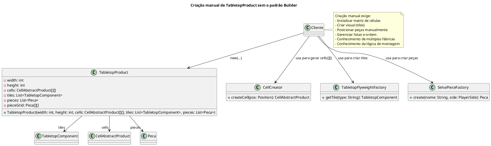
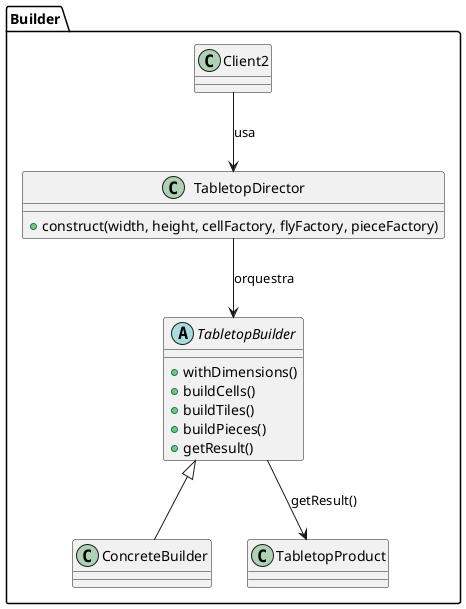

## Builder

### Intenção

Separar a construção de um objeto complexo da sua representação de modo que o mesmo processo de construção possa criar diferentes representações.
(GOF)

### Motivação
Para construir objetos complexos — como peças, células e componentes de um jogo de tabuleiro (TabletopProduct) que possui uma área definida e uma coleção de elementos (como tiles e pieces) — é necessário adotar uma estratégia que permita a configuração gradual e flexível desses objetos, evitando a exposição de um construtor com múltiplos parâmetros.

Sem a utilização de um padrão de projeto, o código cliente teria que instanciar diretamente o tabuleiro utilizando um construtor extenso, como no exemplo abaixo:

Nesse cenário, construir o TabletopProduct manualmente exige que o código cliente conheça e controle cada detalhe do processo: criação das células com CellCreator, montagem visual com TabletopFlyweightFactory, e posicionamento de peças com SelvaPieceFactory. Se o tabuleiro se tornar mais complexo — com novos componentes, peças adicionais ou uma ordem específica de configuração — esse código se torna difícil de manter, altamente repetitivo e fortemente acoplado à lógica interna do produto. Qualquer alteração na estrutura do TabletopProduct obrigaria mudanças em todos os pontos onde ele é instanciado manualmente.

Para resolver esses problemas, aplicamos o padrão Builder. Esse padrão separa a construção do objeto (TabletopProduct) de sua representação final, permitindo que ele seja montado passo a passo. Em vez de o cliente lidar diretamente com a complexidade da montagem, ele utiliza um TabletopBuilder que expõe métodos encadeáveis para configurar dimensões, células, tiles e peças. Por fim, o TabletopDirector coordena a ordem de construção, garantindo que o produto final seja sempre consistente e completo.

No nosso exemplo, o uso do Builder tornou a criação do tabuleiro modular, reutilizável e muito mais legível. O cliente não precisa mais se preocupar com a ordem correta de inicialização ou com os detalhes de cada componente, promovendo uma separação clara entre construção e uso.

## Estrutura do padrão (GOF - papeis)
  

## Padrão aplicado no cenário

No nosso cenário, estamos desenvolvendo um jogo de tabuleiro inspirado no jogo Selva. Durante o processo, identificamos que a criação do objeto TabletopProduct – que representa o tabuleiro e contém diversas estruturas internas, como a grade de células (cells), a lista de peças (pieces), os componentes gráficos (tiles) e a lógica de posicionamento – se tornava excessivamente complexa ao ser feita diretamente por meio de um construtor com múltiplos parâmetros e dependências.

  
## Participantes 

- **Builder (TabletopBuilder):**
  - Define a interface para construir as partes do objeto complexo. 
  - Declara métodos para configurar a área do tabuleiro e os componentes (tiles), retornando o próprio builder para permitir o encadeamento de chamadas.
  - Declara o método getResult() que retorna o produto final.

- **ConcreteBuilder (TabletopConcreteBuilder, ):**
  - Implementa a interface TabletopBuilder.
  - Armazena os valores configurados (como a área e os tiles) e, ao final, constrói e retorna uma instância de TabletopProduct.
  
- **Director (TabletopDirector):**
  - Controla o processo de construção, definindo a ordem e os passos necessários para montar o objeto.
  - Utiliza o builder para construir o objeto complexo, garantindo que ele seja criado de forma consistente.

- **Product (TabletopProduct, SelvaTabletopBuilder):**
  - É o objeto complexo que estamos construindo (o tabuleiro de jogo).
  - Contém atributos como a área (x e y) e a coleção de componentes (tiles).
  - Oferece métodos para acessar suas propriedades.

## Código 

### **TabletopBuilder (Builder)**

@import "framework-tabuleiro/src/builder/TabletopBuilder.java"
### **TabletopConcreteBuilder**

@import "framework-tabuleiro/src/builder/SelvaTabletopBuilder.java"

### **TabletopDirector**

@import "framework-tabuleiro/src/builder/TabletopDirector.java"

### **TabletopProduct**

@import "framework-tabuleiro/src/builder/TabletopDirector.java"