# Builder

## Intenção

Separar a construção de um objeto complexo da sua representação de modo que o mesmo processo de construção possa criar diferentes representações.
(GOF)

## Motivação
Para construir objetos complexos — como peças, células e componentes de um jogo de tabuleiro (TabletopProduct) que possui uma área definida e uma coleção de elementos (como tiles e pieces) — é necessário adotar uma estratégia que permita a configuração gradual e flexível desses objetos, evitando a exposição de um construtor com múltiplos parâmetros.

Sem a utilização de um padrão de projeto, o código cliente teria que instanciar diretamente o tabuleiro utilizando um construtor extenso, como no exemplo abaixo:

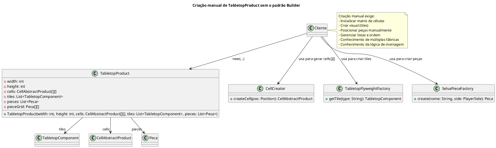

Nesse cenário, construir o TabletopProduct manualmente exige que o código cliente conheça e controle cada detalhe do processo: criação das células com CellCreator, montagem visual com TabletopFlyweightFactory, e posicionamento de peças com SelvaPieceFactory. Se o tabuleiro se tornar mais complexo — com novos componentes, peças adicionais ou uma ordem específica de configuração — esse código se torna difícil de manter, altamente repetitivo e fortemente acoplado à lógica interna do produto. Qualquer alteração na estrutura do TabletopProduct obrigaria mudanças em todos os pontos onde ele é instanciado manualmente.

Para resolver esses problemas, aplicamos o padrão Builder. Esse padrão separa a construção do objeto (TabletopProduct) de sua representação final, permitindo que ele seja montado passo a passo. Em vez de o cliente lidar diretamente com a complexidade da montagem, ele utiliza um TabletopBuilder que expõe métodos encadeáveis para configurar dimensões, células, tiles e peças. Por fim, o TabletopDirector coordena a ordem de construção, garantindo que o produto final seja sempre consistente e completo.

No nosso exemplo, o uso do Builder tornou a criação do tabuleiro modular, reutilizável e muito mais legível. O cliente não precisa mais se preocupar com a ordem correta de inicialização ou com os detalhes de cada componente, promovendo uma separação clara entre construção e uso.

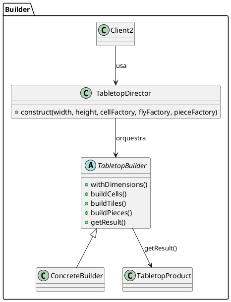

## Estrutura do padrão (GOF - papeis)
  


## Padrão aplicado no cenário

No nosso cenário, estamos desenvolvendo um jogo de tabuleiro inspirado no jogo Selva. Durante o processo, identificamos que a criação do objeto TabletopProduct – que representa o tabuleiro e contém diversas estruturas internas, como a grade de células (cells), a lista de peças (pieces), os componentes gráficos (tiles) e a lógica de posicionamento – se tornava excessivamente complexa ao ser feita diretamente por meio de um construtor com múltiplos parâmetros e dependências.


  
## Participantes 

- **Builder (TabletopBuilder):**
  - Define a interface para construir as partes do objeto complexo. 
  - Declara métodos para configurar a área do tabuleiro e os componentes (tiles), retornando o próprio builder para permitir o encadeamento de chamadas.
  - Declara o método getResult() que retorna o produto final.

- **ConcreteBuilder (TabletopConcreteBuilder, ):**
  - Implementa a interface TabletopBuilder.
  - Armazena os valores configurados (como a área e os tiles) e, ao final, constrói e retorna uma instância de TabletopProduct.
  
- **Director (TabletopDirector):**
  - Controla o processo de construção, definindo a ordem e os passos necessários para montar o objeto.
  - Utiliza o builder para construir o objeto complexo, garantindo que ele seja criado de forma consistente.

- **Product (TabletopProduct, SelvaTabletopBuilder):**
  - É o objeto complexo que estamos construindo (o tabuleiro de jogo).
  - Contém atributos como a área (x e y) e a coleção de componentes (tiles).
  - Oferece métodos para acessar suas propriedades.


## Código 

### **TabletopBuilder (Builder)**


@import "/src/builder/TabletopBuilder.java"

### **TabletopConcreteBuilder**

```java
package builder;

import java.util.List;

import composite.TabletopComponent; 


public class TabletopConcreteBuilder implements TabletopBuilder {
    private int x, y;
    private List<TabletopComponent> tiles;

    @Override
    public TabletopBuilder setArea(int x, int y) {
        this.x = x;
        this.y = y;
        return this;
    }

    @Override
    public TabletopBuilder setTiles(List<TabletopComponent> tiles) {
        this.tiles = tiles;
        return this;
    }

    @Override
    public TabletopProduct getResult() {
        return new TabletopProduct(x, y, tiles);
    }
}

```
### **TabletopDirector**

```java
package builder;

import java.util.List;

import composite.TabletopComponent; 

public class TabletopDirector {
    public TabletopProduct construct(int x, int y, List<TabletopComponent> tiles) {
        TabletopBuilder builder = new TabletopConcreteBuilder();
        return builder.setArea(x, y).setTiles(tiles).getResult();
    }
}


```

### **TabletopProduct**

```java
package builder;

import java.util.List;

import composite.TabletopComponent; 

public class TabletopProduct {
    private int x, y;
    private List<TabletopComponent> tiles;

    public TabletopProduct(int x, int y, List<TabletopComponent> tiles) {
        this.x = x;
        this.y = y;
        this.tiles = tiles;
    }

    public int getX() { return x; }
    public int getY() { return y; }
    public List<TabletopComponent> getTiles() { return tiles; }
}

```

# Composite

## Intenção

Compor objetos em estruturas de árvore para representarem hierarquias partes-todo.
Composite permite aos clientes tratarem de maneira uniforme objetos individuais e
composições de objetos.
(GOF)

## Motivação
Ao desenvolver o jogos de tabuleiro, por exemplo o  jogo Selva, perceberemos que o tabuleiro é composto por diversos componentes que podem ser manipulados de forma hierárquica. Cada peça ou grupo de peças pode ser tratado de maneira uniforme, como um único objeto ou como uma composição de múltiplos objetos. O problema é que o código se torna complexo ao lidar com coleções heterogêneas de objetos, pois o cliente precisa distinguir entre objetos simples e compostos para realizar operações.Fazendo com que o código cliente precise iterar manualmente sobre os tiles do tabuleiro e gerenciar cada um individualmente.


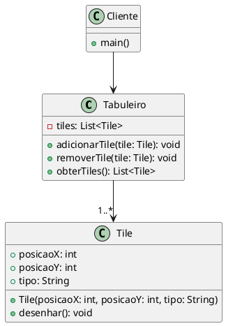
O padrão Composite permite que o cliente trate objetos individuais e composições de objetos de forma uniforme. Assim, um tabuleiro (composto por várias peças) e uma única peça podem ser manipulados de maneira consistente.

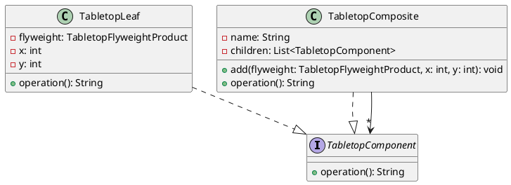

## Estrutura do padrão (GOF - papeis)


## Padrão aplicado no cenário

No nosso cenário, estamos construindo um tabuleiro que pode ser composto por peças individuais ou agrupamentos de peças. Ao aplicar o padrão Composite, conseguimos manipular esses elementos de forma hierárquica e uniforme, facilitando operações complexas como movimentação, remoção ou adição de peças no tabuleiro.
  
## Participantes 


- **Component (TabletopComponent):**
  - Declara a interface comum para objetos individuais e composições. Neste caso, define o método operation() que será implementado tanto pelas folhas quanto pelos compostos.

- **Leaf (TabletopLeaf):**
  - Representa os objetos individuais que não possuem filhos.
  - Implementa a interface TabletopComponent e define o comportamento específico dos objetos folha.
  
- **Composite (TabletopComposite):**
  - Representa objetos que possuem filhos (outros componentes).
  - Implementa métodos para adicionar, remover e acessar os filhos.
  - Implementa a interface TabletopComponent de maneira a delegar operações para os filhos.

## Código 


### **TabletopComponent**

```java
package composite;
// Interface comum para objetos individuais e composições
public interface TabletopComponent {
    String operation();
}
```

### **TabletopComposite**

```java
package composite;
// Objeto composto que pode conter folhas e outros compostos
import java.util.ArrayList;
import java.util.List;

import flyweight.TabletopFlyweightProduct;

public class TabletopComposite implements TabletopComponent {
    private String name;
    private List<TabletopComponent> children;

    public TabletopComposite(String name) {
        this.name = name;
        this.children = new ArrayList<>();
    }

    public void add(TabletopFlyweightProduct flyweight, int x, int y) {
        this.children.add(new TabletopLeaf(flyweight, x, y));
    }

    @Override
    public String operation() {
        StringBuilder sb = new StringBuilder();
        sb.append("Composite: ").append(name).append(" [");
        for (int i = 0; i < children.size(); i++) {
            sb.append(children.get(i).operation());
            if (i < children.size() - 1) sb.append(", ");
        }
        sb.append("]");
        return sb.toString();
    }
}
```

### **TabletopLeaf**

```java
package composite;


import flyweight.TabletopFlyweightProduct;

public class TabletopLeaf implements TabletopComponent {
    private TabletopFlyweightProduct flyweight;
    private int x, y;

    public TabletopLeaf(TabletopFlyweightProduct flyweight, int x, int y) {
        this.flyweight = flyweight;
        this.x = x;
        this.y = y;
    }

    @Override
    public String operation() {
        return flyweight.operation("x:" + x + ",y:" + y);
    }
}
```


# Flyweight

## Intenção

Usar compartilhamento para suportar eficientemente grandes quantidades de objetos de granularidade fina.
(GOF)

## Motivação
No desenvolvimento de jogos de tabuleiro, como o jogo Selva, o tabuleiro é composto por inúmeros tiles que podem apresentar características idênticas. Por exemplo, várias casas do tabuleiro podem ter o mesmo tipo (água, armadilha, toca, etc.).

Sem o Flyweight, cada tile seria instanciado individualmente, consumindo mais memória e tornando o gerenciamento desses objetos mais complexo.


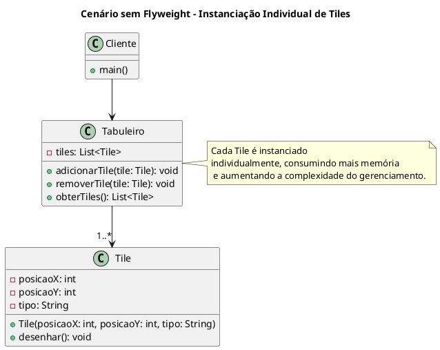

Com o Flyweight, podemos compartilhar instâncias de tiles com estados idênticos, fazendo com que o código cliente não precise criar novas instâncias para cada tile repetido. Assim, o sistema se torna mais leve e eficiente.


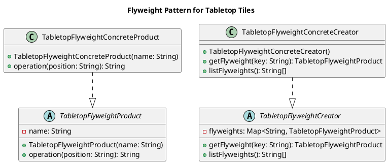

## Estrutura do padrão (GOF - papeis)


## Padrão aplicado no cenário

No cenário do jogo Selva, o tabuleiro possui muitas casas (tiles) que podem ter características repetidas, como a cor ou a função (água, armadilha, toca, etc.).
Utilizando o Flyweight, o sistema cria apenas uma instância para cada tipo de tile e compartilha essa instância entre todas as casas que apresentem o mesmo tipo.
Dessa forma, o cliente não precisa instanciar repetidamente objetos iguais, reduzindo o consumo de memória e simplificando o gerenciamento dos tiles.


  
## Participantes 

- **Flyweight (TabletopFlyweightProduct):**
  - Define a interface para os objetos compartilhados, encapsulando o estado intrínseco (por exemplo, o nome ou tipo do tile).
  - Contém o método operation() que realiza uma operação usando o estado intrínseco, junto com o estado extrínseco (passado como parâmetro, por exemplo, a posição do tile).

- **Concrete Flyweight (TabletopFlyweightConcreteProduct)**
  - Implementa a interface do Flyweight e define o comportamento concreto do tile compartilhado.
  
- **FlyweightFactory (TabletopFlyweightCreator):**
  - Representa objetos que possuem filhos (outros componentes).
  - Implementa métodos para adicionar, remover e acessar os filhos.
  - Implementa a interface TabletopComponent de maneira a delegar operações para os filhos.


## Código 

### **TabletopFlyweightConcreteCreator**

```java
package flyweight;
// Fábrica concreta que reutiliza instâncias de tiles
import java.util.HashMap;

public class TabletopFlyweightConcreteCreator extends TabletopFlyweightFactory {

    public TabletopFlyweightConcreteCreator() {
        flyweights = new HashMap<>();
    }

    @Override
    public TabletopFlyweightProduct getFlyweight(String key) {
        if (!flyweights.containsKey(key)) {
            flyweights.put(key, new TabletopFlyweightConcreteProduct(key));
        }
        return flyweights.get(key);
    }

    @Override
    public String[] listFlyweights() {
        return flyweights.keySet().toArray(new String[0]);
    }
}
```
### **TabletopFlyweightConcreteProduct**
```java
package flyweight;
// Implementação concreta do objeto compartilhado
public class TabletopFlyweightConcreteProduct extends TabletopFlyweightProduct {

    public TabletopFlyweightConcreteProduct(String name) {
        super(name);
    }

    @Override
    public String operation(String position) {
        return "Tile: " + name + " em " + position;
    }
}

```

## **TabletopFlyweightFactory**
```java
package flyweight;
// Interface da fábrica de flyweights
import java.util.Map;

public abstract class TabletopFlyweightFactory {
    protected Map<String, TabletopFlyweightProduct> flyweights;

    public abstract TabletopFlyweightProduct getFlyweight(String key);
    public abstract String[] listFlyweights();
}

```

## **TabletopFlyweightProduct**

```java
package flyweight;
// Compartilha objetos similares para economizar memória
public abstract class TabletopFlyweightProduct {
    protected String name;

    public TabletopFlyweightProduct(String name) {
        this.name = name;
    }

    public abstract String operation(String position);
}
```

# Prototype 

## Intenção

Especificar os tipos de objetos a serem criados usando uma instância-protótipo e criar novos objetos pela cópia desse protótipo.

## Motivação

Em cenários onde os objetos a serem criados são complexos – como um tabuleiro de jogo com uma série de componentes e configurações – a criação direta por meio de um construtor pode ser ineficiente e resultar em código redundante. 

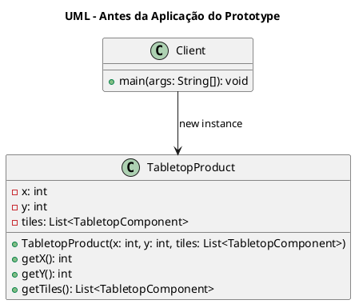
Sem o uso do Prototype, cada vez que um objeto complexo precisasse ser replicado, seria necessário chamar o construtor com todos os seus parâmetros, o que poderia levar a erros e dificultar a manutenção.

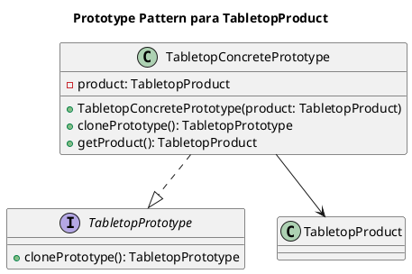

Utilizando o Prototype, o framework pode gerar novas instâncias de um objeto complexo por meio da clonagem de um protótipo previamente configurado. Essa abordagem simplifica a criação de cópias, diminui o acoplamento com classes concretas e torna o sistema mais flexível para alterações futuras, além de melhorar a performance em operações onde a criação completa do objeto seria muito custosa.

## Padrão aplicado no cenário
No nosso cenário, estamos construindo um tabuleiro que pode ser composto por peças individuais ou agrupamentos de peças. Ao aplicar o padrão Composite, conseguimos manipular esses elementos de forma hierárquica e uniforme, facilitando operações complexas como movimentação, remoção ou adição de peças no tabuleiro.

## Estrutura do Padrão (GOF - Papéis)


## Participantes:

- **Prototype (TabletopPrototype):**  
  Define a interface para objetos que podem ser clonados, declarando o método `clonePrototype()`. Essa interface é a base para qualquer objeto que deseje suportar clonagem.

- **ConcretePrototype (TabletopConcretePrototype):**  
  Implementa a interface `TabletopPrototype` e armazena internamente um objeto do tipo `TabletopProduct`. Ao invocar o método `clonePrototype()`, é retornada uma nova instância do protótipo (no caso, utilizando uma cópia superficial do produto).

- **Product (TabletopProduct):**  
  Embora não faça parte direta do padrão Prototype, este objeto complexo é o que está sendo clonado. Ele representa o tabuleiro de jogo com sua configuração e componentes.

## Código

### **TabletopPrototype**

```java
package prototype;
// Interface para objetos que podem ser clonados
public interface TabletopPrototype {
    TabletopPrototype clonePrototype();
}
```

### **TabletopConcretePrototype**

```java
package prototype;
// Implementação concreta do protótipo

import builder.TabletopProduct;

public class TabletopConcretePrototype implements TabletopPrototype {
    private TabletopProduct product;

    public TabletopConcretePrototype(TabletopProduct product) {
        this.product = product;
    }

    @Override
    public TabletopPrototype clonePrototype() {
        return new TabletopConcretePrototype(product); // shallow copy
    }

    public TabletopProduct getProduct() {
        return product;
    }
}
```

# Observer

## Intenção

Definir uma dependência um-para-muitos entre objetos, de maneira que quando um
objeto muda de estado todos os seus dependentes são notificados e atualizados
automaticamente

## Motivação

Em um framework de jogo de tabuleiro, diversas partes do sistema podem precisar reagir a alterações no estado do jogo, como atualizações na pontuação, mudança de turno ou alterações no estado do tabuleiro. Sem o Observer Pattern, cada componente precisaria interrogar constantemente o estado do jogo ou ser explicitamente atualizado por métodos diretos, aumentando o acoplamento e a complexidade do código.
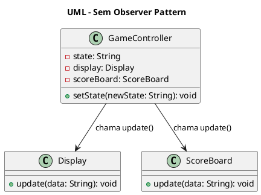

Com o Observer Pattern, o sujeito central (por exemplo, um controlador de estado do jogo) notifica automaticamente todos os observadores registrados assim que seu estado muda, garantindo que a interface do usuário, o sistema de pontuação e outros módulos recebam as atualizações em tempo real e de forma desacoplada.

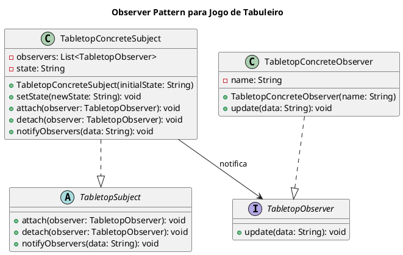

## Estrutura do Padrão (GOF - Papéis)


## Participantes

- **Observer (TabletopObserver):**
  - Define a interface para os observadores que desejam receber atualizações.
  - Declara o método `update(String data)`, que será chamado pelo sujeito quando ocorrer uma mudança de estado.

- **Subject (TabletopSubject):**
  - Define a interface ou classe abstrata para o sujeito observado.
  - Declara os métodos `attach(TabletopObserver observer)`, `detach(TabletopObserver observer)` e `notifyObservers(String data)`, responsáveis por gerenciar os observadores e disseminar atualizações.

- **ConcreteSubject (TabletopConcreteSubject):**
  - Implementa a classe abstrata `TabletopSubject` e mantém o estado interno do objeto.
  - Quando seu estado é alterado (por meio do método `setState(String newState)`), ele notifica todos os observadores registrados.

- **ConcreteObserver (TabletopConcreteObserver):**
  - Implementa a interface `TabletopObserver`.
  - Define o comportamento do observador quando uma atualização é recebida, por exemplo, exibindo a mensagem de atualização no console.
  
## Código

### **TabletopConcreteObserver**

```java
package observer;
// Observador concreto
public class TabletopConcreteObserver implements TabletopObserver {
    private String name;

    public TabletopConcreteObserver(String name) {
        this.name = name;
    }

    @Override
    public void update(String data) {
        System.out.println(name + " recebeu atualização: " + data);
    }
}
```

### **TabletopConcreteSubject**
```java
package observer;
// Sujeito concreto que mantém estado
import java.util.ArrayList;
import java.util.List;

public class TabletopConcreteSubject extends TabletopSubject {
    private List<TabletopObserver> observers = new ArrayList<>();
    private String state;

    public TabletopConcreteSubject(String initialState) {
        this.state = initialState;
    }

    public void setState(String newState) {
        this.state = newState;
        notifyObservers(this.state);
    }

    @Override
    public void attach(TabletopObserver observer) {
        observers.add(observer);
    }

    @Override
    public void detach(TabletopObserver observer) {
        observers.remove(observer);
    }

    @Override
    public void notifyObservers(String data) {
        for (TabletopObserver observer : observers) {
            observer.update(data);
        }
    }
}

```

### **TabletopObserver**
```java
package observer;
// Interface para observadores
public interface TabletopObserver {
    void update(String data);
}
```

### **TabletopSubject**
```java
package observer;
// Interface do sujeito observado
public abstract class TabletopSubject {
    public abstract void attach(TabletopObserver observer);
    public abstract void detach(TabletopObserver observer);
    public abstract void notifyObservers(String data);
}
```

# Factory Method Pattern

##  Intenção

Definir uma interface para criar um objeto, mas deixar as subclasses decidirem que classe instanciar. O Factory Method permite adiar a instanciação para subclasses.

## Motivação

Em um framework de jogo de tabuleiro, a criação de diferentes produtos (como peças, tabuleiros ou componentes) pode variar conforme o contexto e as regras do jogo. Sem um padrão de criação centralizada, o código cliente precisaria conhecer os detalhes de instanciamento de cada produto, aumentando o acoplamento e a complexidade. 
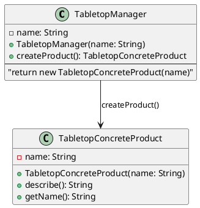

Com o Factory Method, o processo de criação é encapsulado em um criador abstrato, permitindo a flexibilidade e a reutilização do código ao instanciar os produtos corretos conforme a necessidade.

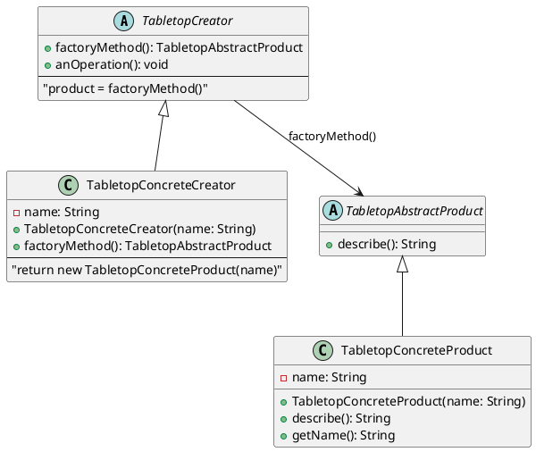

## Estrutura do Padrão (GOF - Papéis)


## Participantes

- **Creator (TabletopCreator):**
  - Classe abstrata que declara o método `factoryMethod()`, responsável pela criação do produto abstrato.
  - Possui também o método `createProduct()`, que chama o `factoryMethod()` e retorna o produto.

- **ConcreteCreator (TabletopConcreteCreator):**
  - Implementa o método `factoryMethod()`, instanciando um produto concreto de acordo com a lógica do sistema.

- **Product (TabletopAbstractProduct):**
  - Classe abstrata que define a interface dos produtos criados.
  - Declara o método `describe()`, que será implementado pelas classes concretas.

- **ConcreteProduct (TabletopConcreteProduct):**
  - Implementa a interface do produto, fornecendo uma descrição e métodos específicos para o produto concreto.

---

## Código

### **TabletopAbstractProduct**
```java
// Produto abstrato
public abstract class TabletopAbstractProduct {
    public abstract String describe();
}
```
### **TabletpoConcreteCreator**
```java
// Criador concreto
public class TabletopConcreteCreator extends TabletopCreator {
    private String name;

    public TabletopConcreteCreator(String name) {
        this.name = name;
    }

    @Override
    public TabletopAbstractProduct factoryMethod() {
        return new TabletopConcreteProduct(name);
    }
}
```
### **TabletopConcreteProduct**
```java
// Produto concreto
public class TabletopConcreteProduct extends TabletopAbstractProduct {
    private String name;

    public TabletopConcreteProduct(String name) {
        this.name = name;
    }

    @Override
    public String describe() {
        return "ConcreteProduct: " + name;
    }

    public String getName() {
        return name;
    }
}
```

### **TabletopCreator**
```java
// Criador abstrato
public abstract class TabletopCreator {
    public abstract TabletopAbstractProduct factoryMethod();

    public TabletopAbstractProduct createProduct() {
        return factoryMethod();
    }
}
```
### **TableConcreteCreator**
```java
// Produto concreto
public class TabletopConcreteProduct extends TabletopAbstractProduct {
    private String name;

    public TabletopConcreteProduct(String name) {
        this.name = name;
    }

    @Override
    public String describe() {
        return "ConcreteProduct: " + name;
    }

    public String getName() {
        return name;
    }
}


```


# Command Pattern

## Intenção

Encapsular uma solicitação como um objeto, desta forma permitindo parametrizar clientes com diferentes solicitações, enfileirar ou fazer o registro (log) de solicitações e suportar operações que podem ser desfeitas

## Motivação

Em um framework de jogo de tabuleiro, sem o padrão Command o cliente (por exemplo, a interface de usuário) teria que chamar diretamente métodos das peças (ex.: `mover()`). Isso leva a algumas dificuldades:

- **Acoplamento Elevado:** O cliente precisaria conhecer os detalhes da implementação e do receptor, tornando difícil modificar a lógica ou substituir funcionalidades.
- **Dificuldade para Log e Replay:** Sem o encapsulamento, registrar as jogadas e reproduzi-las (replay) exigiria lógica repetitiva e espalhada.
- **Complexidade no Suporte a Undo/Redo:** Sem Command, implementar desfazer e refazer operações demandaria que a lógica de reversão estivesse presente em vários pontos da aplicação.

Com o Command, cada ação do jogo (como mover uma peça) é encapsulada em um objeto comando. Isso possibilita registrar, enfileirar, reexecutar e, futuramente, desfazer ações sem que o cliente precise entender os detalhes da implementação.

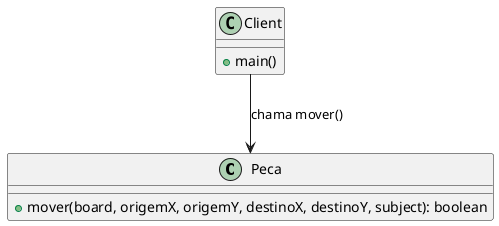

Com o padrão Command, o processo de execução torna-se independente do receptor. O cliente simplesmente invoca o comando, que registra e executa a ação, possibilitando o registro para replay e suporte a undo/redo (se implementado).

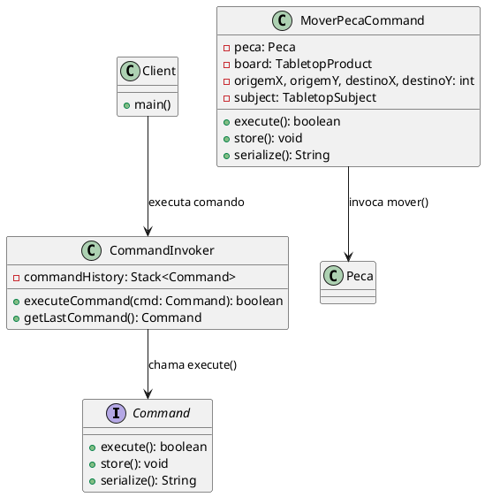
## Estrutura do Padrão (GOF - Papéis)

### Participantes
- **Command (Interface Command):**
  - Declara uma interface para a execução da operação (execute()), armazenamento (store()) e serialização (serialize()).

- **ConcreteCommand (MoverPecaCommand):**
  - Encapsula a ação de mover uma peça, armazenando o receptor (a peça) e os detalhes da operação (coordenadas de origem e destino, tabuleiro e sujeito para notificação).
  - Implementa execute(), que chama o método mover() da peça, e armazena o comando em log, possibilitando seu registro.

- **Invoker (CommandInvoker):**
  - Solicita a execução do comando.
  - Armazena os comandos executados em um histórico, possibilitando ações futuras como "undo" ou "redo".

- **Client (CommandLogManager / Interface de Usuário):**
  - Cria instâncias de comandos com os dados necessários.
  - Pode carregar comandos previamente armazenados para reexecução (replay) através do log.

- **Receiver (Peca):**
  - Contém o conhecimento para executar a solicitação (por exemplo, mover-se no tabuleiro).
  - Interage com outros padrões (Strategy, State, Observer) para validar e executar a ação.
  
## Exemplo de Código: 

### Command
```java
package command;

public interface Command {
    boolean execute();
    void store();
    String serialize();
}
```
### MoverPecaCommand - ConcreteCommand

```java
package command;

import context.Peca;
import builder.TabletopProduct;
import observer.TabletopSubject;
import java.io.FileWriter;
import java.io.IOException;
import java.io.PrintWriter;

public class MoverPecaCommand implements Command {

    private Peca peca;
    private TabletopProduct board;
    private int origemX, origemY, destinoX, destinoY;
    private TabletopSubject subject;
    
    public MoverPecaCommand(Peca peca, TabletopProduct board,
                            int origemX, int origemY,
                            int destinoX, int destinoY,
                            TabletopSubject subject) {
        this.peca = peca;
        this.board = board;
        this.origemX = origemX;
        this.origemY = origemY;
        this.destinoX = destinoX;
        this.destinoY = destinoY;
        this.subject = subject;
    }
    
    @Override
    public boolean execute() {
        System.out.println("Executando comando para mover a peça " + peca.getNome());
        boolean resultado = peca.mover(board, origemX, origemY, destinoX, destinoY, subject);
        if(resultado) {
            store();
        }
        return resultado;
    }
    
    @Override
    public String serialize() {
        return "MoverPecaCommand;" + peca.getNome() + ";" + origemX + ";" + origemY + ";" + destinoX + ";" + destinoY;
    }
    
    @Override
    public void store() {
        try (PrintWriter out = new PrintWriter(new FileWriter("command.log", true))) {
            out.println(serialize());
            System.out.println("Comando armazenado: " + serialize());
        } catch(IOException e) {
            System.err.println("Erro ao armazenar comando: " + e.getMessage());
        }
    }
}
```
###  CommandInvoker - Invoker
```java

package command;

import java.util.Stack;

public class CommandInvoker {
    private Stack<Command> commandHistory = new Stack<>();
    
    public boolean executeCommand(Command command) {
        boolean result = command.execute();
        if(result) {
            commandHistory.push(command);
        }
        return result;
    }
    
    public Command getLastCommand() {
        if (!commandHistory.isEmpty()) {
            return commandHistory.peek();
        }
        return null;
    }
}

```

### CommandLogManager - Client Help
```java
package command;

import java.io.BufferedReader;
import java.io.FileReader;
import java.io.IOException;
import java.util.ArrayList;
import builder.TabletopProduct;
import context.Peca;
import observer.TabletopSubject;
import strategy.LeaoMovimentoStrategy;

public class CommandLogManager {

   
    public static ArrayList<Command> loadCommands(TabletopProduct board, TabletopSubject subject) {
        ArrayList<Command> comandos = new ArrayList<>();
        try (BufferedReader reader = new BufferedReader(new FileReader("command.log"))) {
            String linha;
            while ((linha = reader.readLine()) != null) {
             
                String[] parts = linha.split(";");
                if (parts.length == 6 && parts[0].equals("MoverPecaCommand")) {
                    String nomePeca = parts[1];
                    int ox = Integer.parseInt(parts[2]);
                    int oy = Integer.parseInt(parts[3]);
                    int dx = Integer.parseInt(parts[4]);
                    int dy = Integer.parseInt(parts[5]);
                    
                    
                    Peca peca = new Peca(nomePeca, new LeaoMovimentoStrategy());
                    Command cmd = new MoverPecaCommand(peca, board, ox, oy, dx, dy, subject);
                    comandos.add(cmd);
                }
            }
        } catch (IOException e) {
            System.err.println("Erro ao carregar comandos do log: " + e.getMessage());
        }
        return comandos;
    }
}
```
## Considerações Finais
- Aplicar o padrão Command ao framework do jogo de tabuleiro oferece os seguintes benefícios:

- Desacoplamento: O cliente (interface ou lógica de controle) invoca comandos sem conhecer os detalhes da execução.

- Histórico de Ações: Cada comando é registrado, permitindo a implementação de replays ou de sistemas de undo/redo.

- Flexibilidade: É simples adicionar novos comandos ou combinar comandos existentes (através de um MacroCommand), facilitando a evolução do sistema.

- Registro e Persistência: Com a serialização e armazenamento no log, o sistema pode restaurar jogadas, facilitando a análise e correção de erros após uma queda de sistema.

# Strategy Pattern

## Intenção
Definir uma família de algoritmos, encapsular cada uma delas e torná-las intercambiáveis. Strategy permite que o algoritmo varie independentemente dos clientes que o utilizam.

## Motivação
Em um framework de jogo de tabuleiro, diferentes peças podem ter regras de movimentação distintas. Sem o padrão Strategy, teríamos que ter uma lógica condicional pesada dentro de cada peça para tratar variações no movimento (como movimentos básicos, saltos, ou movimentos especiais). Isso acarreta:

- Complexidade e Acoplamento: Toda a lógica de movimentação ficaria acoplada à classe da peça, dificultando a manutenção e a extensão.

- Dificuldade para Modificar Algoritmos: Alterar uma regra de movimentação implicaria alterar a classe da peça diretamente, afetando possivelmente várias áreas do sistema.

- Reutilização de Algoritmos: Permite utilizar o mesmo algoritmo de movimentação para diferentes tipos de peças, promovendo a reutilização e a consistência.

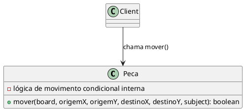

Com o Strategy, encapsulamos as diferentes regras de movimentação em classes separadas. Assim, a peça se torna um contexto que delega a sua operação de movimento à estratégia vigente, permitindo a mudança dinâmica do comportamento sem alterar o código da peça.

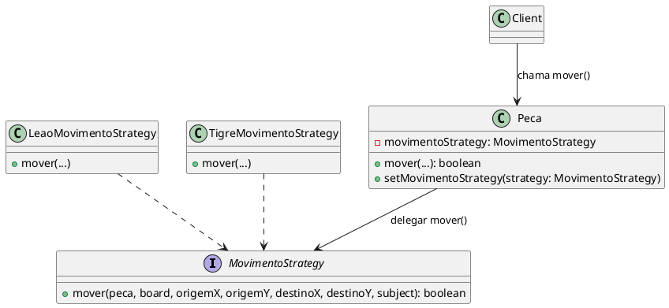

## Estrutura do Padrão (GOF - Papéis)
### Participantes

- **Strategy (Interface MovimentoStrategy):**
  - Declara uma interface para o algoritmo de movimentação, possibilitando que diferentes implementações sejam utilizadas de forma intercambiável.

- **ConcreteStrategy (LeaoMovimentoStrategy, TigreMovimentoStrategy):**
  - Implementa a interface MovementStrategy com comportamentos específicos. Por exemplo, LeaoMovimentoStrategy define as regras de movimento para o Leão (movimento básico e salto sobre água).

- **Context (Peca):**
  - Possui uma referência a um objeto do tipo MovimentoStrategy e delega a operação de movimento a essa estratégia. O contexto pode alterar a estratégia em tempo de execução para mudar seu comportamento.

- **Client:**
  - Configura o contexto com uma estratégia concreta e invoca a operação de movimento, sem se preocupar com os detalhes de implementação do algoritmo.

## Exemplo de Código

#### Interface MovimentoStrategy

```java
package strategy;

import builder.TabletopProduct;
import observer.TabletopSubject;

public interface MovimentoStrategy {
    
    boolean mover(Object peca, TabletopProduct board,
                  int origemX, int origemY, 
                  int destinoX, int destinoY,
                  TabletopSubject subject);
}
```

#### LeaoMovimentoStrategy - ConcreteStrategy

```java
package strategy;

import builder.TabletopProduct;
import observer.TabletopSubject;

public class LeaoMovimentoStrategy implements MovimentoStrategy {

    @Override
    public boolean mover(Object peca, TabletopProduct board,
                         int origemX, int origemY, 
                         int destinoX, int destinoY,
                         TabletopSubject subject) {
        
      
        boolean movimentoValido = verificaMovimentoBasico(origemX, origemY, destinoX, destinoY);
        
 
        if (estaSaltandoSobreAgua(origemX, origemY, destinoX, destinoY)) {
            
            movimentoValido = true; 
        }
        
        if (movimentoValido) {
            atualizarTabuleiro(board, origemX, origemY, destinoX, destinoY, peca);
            
            
            subject.notifyObservers("Leão moveu-se de (" + origemX + "," + origemY + 
                                    ") para (" + destinoX + "," + destinoY + ")");
        }
        
        return movimentoValido;
    }
    
  
    private boolean verificaMovimentoBasico(int ox, int oy, int dx, int dy) {
        int difX = Math.abs(dx - ox);
        int difY = Math.abs(dy - oy);
        return ((difX == 1 && difY == 0) || (difX == 0 && difY == 1));
    }

    private boolean estaSaltandoSobreAgua(int ox, int oy, int dx, int dy) {
        int distancia = Math.abs(dx - ox) + Math.abs(dy - oy);
        return (distancia > 1);
    }
    
  
    private void atualizarTabuleiro(TabletopProduct board,
                                    int origemX, int origemY,
                                    int destinoX, int destinoY, Object peca) {
   
        System.out.println("Atualizando tabuleiro: movendo peça de (" 
                            + origemX + "," + origemY + ") para (" 
                            + destinoX + "," + destinoY + ").");
    }
}

```

#### Context (Peca)

```java
package context; 

import builder.TabletopProduct;
import observer.TabletopSubject;
import strategy.MovimentoStrategy;
import state.PecaState;
import state.NormalState;

public class Peca {
    
    private String nome;
    private MovimentoStrategy movimentoStrategy;
    
    private PecaState state;
    
    public Peca(String nome, MovimentoStrategy movimentoStrategy) {
        this.nome = nome;
        this.movimentoStrategy = movimentoStrategy;
        this.state = new NormalState();
    }
    
    public void setMovimentoStrategy(MovimentoStrategy movimentoStrategy) {
        this.movimentoStrategy = movimentoStrategy;
    }
    
    public MovimentoStrategy getMovimentoStrategy() {
        return movimentoStrategy;
    }
    
    public void setState(PecaState state) {
        this.state = state;
    }
    
    public PecaState getState() {
        return state;
    }
    
    public boolean mover(TabletopProduct board,
                         int origemX, int origemY,
                         int destinoX, int destinoY,
                         TabletopSubject subject) {
        return state.mover(this, board, origemX, origemY, destinoX, destinoY, subject);
    }
    
    public String getNome() {
        return nome;
    }
}

```

## Considerações Finais
- **Desacoplamento do Algoritmo:**
  - A lógica de movimentação é separada da classe Peca, permitindo que estratégias diferentes sejam aplicadas sem modificar o contexto.

- **Flexibilidade e Extensibilidade:**
  - Novos comportamentos de movimento podem ser adicionados como novas implementações de MovimentoStrategy sem a necessidade de alterar a classe Peca ou outras partes do sistema.

- **Reutilização:**
O mesmo algoritmo de movimentação pode ser utilizado por diversas peças, promovendo a reutilização e facilitando a manutenção.