# Construção do Jogo Selva - Framework de Tabuleiro

A Selva é um antigo jogo indiano, também conhecido como Xadrez da Selva (no entanto, por ter muitas diferenças, não é incluído na categoria dos jogos de Xadrez). Joga-se num tabuleiro de 7 x 9 que contém casas com água (azuis), tocas (a negro) e armadilhas (magenta).

## Contexto do Projeto: 

Elaborar um framework, com no mínimo 12 dos padrões de projetos vistos na disciplina (com no mínimo 3 de cada grupo), para a construção de um jogo de tabuleiro nos moldes de JogoSelva.

## Resumo - Padrões Utilizados no Framework: 

| Padrão                | Intenção                                                                                                                                       | Uso no Projeto                                                                                                       |
|-----------------------|------------------------------------------------------------------------------------------------------------------------------------------------|----------------------------------------------------------------------------------------------------------------------|
| Abstract Factory      | Fornecer uma interface para criar famílias de objetos relacionados sem expor suas classes concretas.                                          | `SelvaPieceFactoryImpl` gera cada peça (`Elefante`, `Leão` etc.) com nome, lado e estratégia corretos.              |
| Builder               | Construir objetos complexos passo a passo, isolando a lógica de construção.                                                                    | `SelvaTabletopBuilder` (via `TabletopDirector`) monta células, tiles (visuais) e posiciona peças, retornando o tabuleiro. |
| Factory Method        | Delegar a criação de um objeto a subclasses, escondendo a lógica de “qual classe instanciar”.                                                 | `SelvaCellCreator` escolhe que tipo de célula (`LandCell`, `WaterCell`, `TrapCell`, `DenCell`) criar para cada posição. |
| Prototype             | Clonar objetos existentes em vez de criá‑los do zero, facilitando cópias profundas ou rasas.                                                  | `TabletopConcretePrototype.deepClone()` copia células, tiles e peças para salvar/restaurar estados do tabuleiro.     |
| Singleton             | Garantir que uma classe tenha apenas uma instância e fornecer um ponto de acesso global.                                                      | `TurnManager` controla de forma centralizada de quem é a vez de jogar.                                               |
| Flyweight             | Compartilhar objetos imutáveis e pesados (estado intrínseco) para economizar memória.                                                         | `TabletopFlyweightFactory` reaproveita instâncias de ícones/tiles (água, grama, tocas, armadilhas).                |
| Composite             | Tratar composições e objetos simples uniformemente através de uma interface comum.                                                             | `TabletopComposite` agrupa `TabletopLeaf` (tiles renderizados) para montar toda a visão visual do tabuleiro.        |
| Strategy              | Encapsular algoritmos intercambiáveis e escolher o comportamento em tempo de execução.                                                         | Diversas `*MovimentoStrategy` definem regras de movimento/captura para cada tipo de peça.                          |
| State                 | Alterar o comportamento de um objeto quando seu estado interno muda, sem expor classes internas.                                               | `NormalState` permite mover; `BloqueadaState` bloqueia o movimento de uma peça.                                     |
| Template Method       | Definir o esqueleto de um algoritmo em uma classe-mãe, deixando que subclasses completem etapas específicas.                                    | `AbstractBoardDivider` orienta a divisão “branco”/“preto” do tabuleiro, `StandardBoardDivider` implementa os detalhes. |
| Command + Memento     | Encapsular requisições como objetos (`Command`) e salvar/restaurar estado anterior (`Memento`) para permitir `undo` e `replay`.                | `MoverPecaCommand` registra cada jogada, `BoardMemento` salva o estado do tabuleiro para desfazer movimentos.      |
| Observer              | Notificar objetos interessados quando um sujeito muda de estado, mantendo baixo acoplamento.                                                   | `TabletopSubject` avisa `TabletopConcreteObserver` sobre eventos (tabuleiro configurado, peça movida, undo).       |
| Chain of Responsibility | Passar uma requisição através de uma cadeia de validadores até que um aceite ou rejeite a ação, separando as checagens.                     | `MoveValidator` e subclasses validam cada regra de movimento antes de executar o comando.                           |
| Front Controller      | Centralizar o ponto de entrada de comandos (ou requisições), despachando cada um para o serviço ou estado apropriado.                           | `GameController` lê comandos do usuário (`start`, `move`, `undo`, `replay`, `end`) e gerencia o ciclo de jogo.     |

## Padrões Utilizados no Framework/Jogo Selva

# 1. Builder

### Intenção

Separar a construção de um objeto complexo da sua representação de modo que o mesmo processo de construção possa criar diferentes representações.


### Motivação
Para construir objetos complexos — como peças, células e componentes de um jogo de tabuleiro (TabletopProduct) que possui uma área definida e uma coleção de elementos (como tiles e pieces) — é necessário adotar uma estratégia que permita a configuração gradual e flexível desses objetos, evitando a exposição de um construtor com múltiplos parâmetros.

Sem a utilização de um padrão de projeto, o código cliente teria que instanciar diretamente o tabuleiro utilizando um construtor extenso, como no exemplo abaixo:

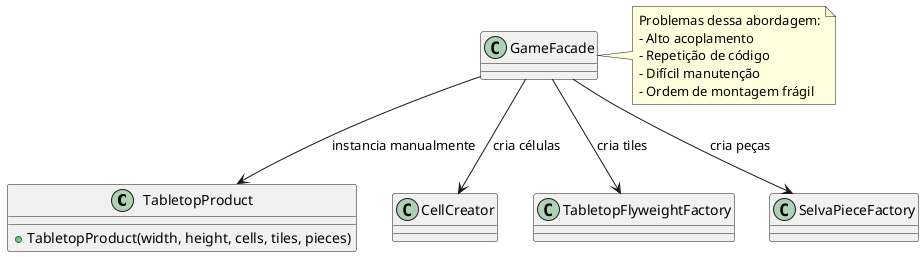

Nesse cenário, construir o TabletopProduct manualmente exige que o código cliente conheça e controle cada detalhe do processo: criação das células com CellCreator, montagem visual com TabletopFlyweightFactory, e posicionamento de peças com SelvaPieceFactory. Se o tabuleiro se tornar mais complexo — com novos componentes, peças adicionais ou uma ordem específica de configuração — esse código se torna difícil de manter, altamente repetitivo e fortemente acoplado à lógica interna do produto. Qualquer alteração na estrutura do TabletopProduct obrigaria mudanças em todos os pontos onde ele é instanciado manualmente.

Para resolver esses problemas, aplicamos o padrão Builder. Esse padrão separa a construção do objeto (TabletopProduct) de sua representação final, permitindo que ele seja montado passo a passo. Em vez de o cliente lidar diretamente com a complexidade da montagem, ele utiliza um TabletopBuilder que expõe métodos encadeáveis para configurar dimensões, células, tiles e peças. Por fim, o TabletopDirector coordena a ordem de construção, garantindo que o produto final seja sempre consistente e completo.

No nosso exemplo, o uso do Builder tornou a criação do tabuleiro modular, reutilizável e muito mais legível. O cliente não precisa mais se preocupar com a ordem correta de inicialização ou com os detalhes de cada componente, promovendo uma separação clara entre construção e uso.

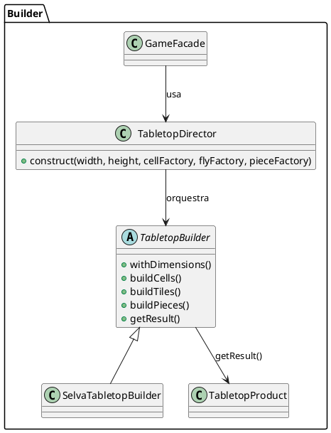

## Estrutura do padrão (GOF - papeis)
  


## Padrão aplicado no cenário

A montagem de um TabletopProduct, que representa o tabuleiro com suas peças e células, exige diversas etapas interdependentes: criação das tiles, posicionamento das peças e configuração da estrutura geral. Sem um padrão de construção, o código cliente teria que orquestrar diretamente todas essas etapas, utilizando várias classes como CellCreator, TabletopFlyweightFactory e SelvaPieceFactoryImpl em ordem manual, o que resultaria em código repetitivo, frágil e difícil de manter.

Com o uso do padrão Builder, essas etapas foram encapsuladas em implementações como SelvaTabletopBuilder, que se responsabiliza por construir os elementos do tabuleiro. O TabletopDirector coordena a ordem correta da montagem, chamando métodos como buildTiles() e buildPieces() de forma centralizada. Isso permite que o cliente apenas chame director.construct() para obter um tabuleiro montado corretamente, sem precisar conhecer os detalhes da composição interna.


  
## Participantes 

| Papel                   | Classe                    | Descrição                                                                                                                                          |
|-------------------------|---------------------------|----------------------------------------------------------------------------------------------------------------------------------------------------|
| **Builder**             | `TabletopBuilder`         | Define a interface para construir as partes do objeto complexo. Declara métodos para configurar a área do tabuleiro e os componentes (tiles), retornando o próprio builder para encadeamento. E expõe `getResult()` que retorna o produto final. |
| **ConcreteBuilder**     | `SelvaTabletopBuilder`    | Implementa `TabletopBuilder`. Armazena os valores configurados (área, matriz de células, tiles e peças) e, ao final, constrói e retorna uma instância de `TabletopProduct`.                              |
| **Director**            | `TabletopDirector`        | Controla o processo de construção, definindo a ordem e os passos necessários para montar o objeto. Utiliza o builder para criar de forma consistente o `TabletopProduct`.                             |
| **Product**             | `TabletopProduct`         | É o objeto complexo resultante (o tabuleiro de jogo). Contém atributos como dimensões, matriz de células, coleção de componentes (tiles) e peças, e oferece métodos para acessá-los.               |


## Código 

### **TabletopBuilder (Builder)**

@import "framework-tabuleiro/src/builder/TabletopBuilder.java"

### **TabletopConcreteBuilder**

@import "framework-tabuleiro/src/builder/SelvaTabletopBuilder.java"

### **TabletopDirector**

@import "framework-tabuleiro/src/builder/TabletopDirector.java"


### **TabletopProduct**

@import "framework-tabuleiro/src/builder/TabletopDirector.java"

# 2. Factory Method

##  Intenção

Definir uma interface para criar um objeto, mas deixar as subclasses decidirem que classe instanciar. O Factory Method permite adiar a instanciação para subclasses.

## Motivação

Em um framework de jogo de tabuleiro como o Selva, as células do tabuleiro possuem diferentes tipos (grama, água, armadilhas, tocas), e a criação de cada tipo deve seguir regras específicas de posicionamento. Sem um padrão adequado, o código cliente precisaria instanciar manualmente as classes concretas (LandCell, TrapCell, DenCell, etc.), o que tornaria o sistema rígido, com alto acoplamento e difícil de manter.

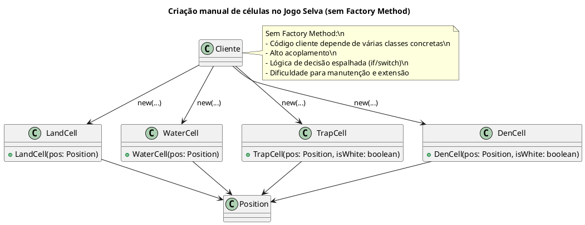

Com o Factory Method, o processo de criação é encapsulado em um criador abstrato, permitindo a flexibilidade e a reutilização do código ao instanciar os produtos corretos conforme a necessidade.

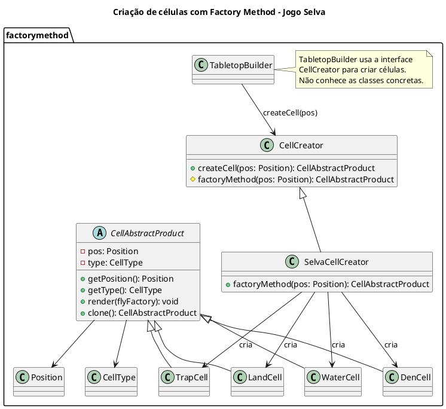

## Estrutura do Padrão (GOF - Papéis)


## Padrão aplicado no cenário

Durante a construção do tabuleiro, diferentes tipos de células precisam ser criadas no jogo Selva (como LandCell, TrapCell, WaterCell, etc.). Com o padrão Factory Method, cada tipo de célula possui seu próprio CellCreator concreto, como WaterCellCreator, que encapsula a lógica de criação. O cliente trabalha com a interface CellCreator e não precisa conhecer a implementação real. Isso facilita a extensão do sistema com novos tipos de célula, respeitando o princípio do aberto-fechado.

## Participantes

| Papel                   | Classe                     | Descrição                                                                                                                                       |
|-------------------------|----------------------------|-------------------------------------------------------------------------------------------------------------------------------------------------|
| **Creator**             | `CellCreator`              | Classe abstrata que declara o método `createCell(pos)` e delega a criação ao `factoryMethod(pos)`. Fornece uma interface comum para criadores de células. |
| **ConcreteCreator**     | `SelvaCellCreator`         | Implementa `factoryMethod(pos)` com lógica de decisão baseada na posição, criando diferentes tipos de células (`LandCell`, `WaterCell`, etc.). |
| **ConcreteCreator**     | `LandCellCreator`, `TrapCellCreator`, etc. | Fornecem implementação direta e fixa de um tipo específico de célula do jogo (`LAND`, `TRAP`, etc.).                                           |
| **Product**             | `CellAbstractProduct`      | Classe abstrata que define a interface comum para todas as células do jogo. Define métodos como `render()` e `clone()`.                        |
| **ConcreteProduct**     | `LandCell`, `WaterCell`, `TrapCell`, `DenCell` | Implementam `CellAbstractProduct` com comportamentos específicos de cada tipo de célula.                                                        |
| **Cliente**             | `TabletopBuilder`          | Usa o Factory Method indiretamente ao chamar `createCell()` no processo de construção do tabuleiro, desacoplando o cliente das classes concretas. |


---

## Código

### **TabletopAbstractProduct (CellAbstractProduct)**

@import "framework-tabuleiro/src/factorymethod/CellAbstractProduct.java"

@import "framework-tabuleiro/src/factorymethod/TabletopAbstractProduct.java"


### **TabletpoConcreteCreator (DenBlackCellCreator, DenWhiteCellCreator,WaterCellCreator,LandCellCreator, TrapWhiteCellCreator, TrapBlackCellCreator, SelvaCellCreator)**

@import "framework-tabuleiro/src/factorymethod/DenBlackCellCreator.java"

@import "framework-tabuleiro/src/factorymethod/DenWhiteCellCreator.java"

@import "framework-tabuleiro/src/factorymethod/WaterCellCreator.java"

@import "framework-tabuleiro/src/factorymethod/LandCellCreator.java"

@import "framework-tabuleiro/src/factorymethod/TrapWhiteCellCreator.java"

@import "framework-tabuleiro/src/factorymethod/TrapBlackCellCreator.java"

@import "framework-tabuleiro/src/factorymethod/TabletopConcreteCreator.java"

@import "framework-tabuleiro/src/factorymethod/SelvaCellCreator.java"

### **TabletopConcreteProduct (LandCell,DenCell,WaterCell,TrapCell)**

@import "framework-tabuleiro/src/factorymethod/DenCell.java"

@import "framework-tabuleiro/src/factorymethod/WaterCell.java"

@import "framework-tabuleiro/src/factorymethod/TrapCell.java"

@import "framework-tabuleiro/src/factorymethod/TabletopConcreteProduct.java"


### **TabletopCreator, CellCreator**


@import "framework-tabuleiro/src/factorymethod/TabletopCreator.java"

@import "framework-tabuleiro/src/factorymethod/CellCreator.java"


# 3. Abstract Factory

## Intenção 

Fornecer uma interface para criação de famílias de objetos relacionados ou dependentes sem especificar suas classes concretas.

## Motivação

Em um jogo como Selva, cada jogador possui várias peças diferentes (Leão, Elefante, Rato, etc.), e cada uma dessas peças precisa ser criada com:

Um nome específico

Uma estratégia de movimentação diferente

Um lado (branco ou preto)

E uma posição inicial no tabuleiro

Sem um padrão adequado, o código de inicialização do jogo precisaria conter múltiplas linhas como:

```java
Peca leaoBranco = new Peca("Leão", PlayerSide.WHITE, new LeaoMovimentoStrategy(), new Position(0, 3));
Peca elefantePreto = new Peca("Elefante", PlayerSide.BLACK, new ElefanteMovimentoStrategy(), new Position(6, 2));
// e assim por diante...
```

**UML - Sem Padrão** 

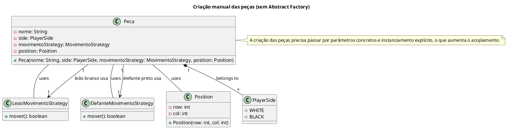

Com o uso do padrão Abstract Factory, definimos uma interface para criação de famílias de peças relacionadas, e implementamos essa fábrica conforme as regras do jogo Selva. Isso permite:

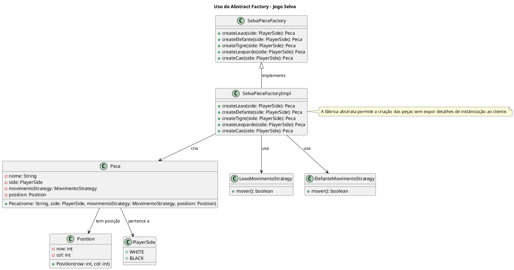

- Encapsular a lógica de criação de peças em um único lugar

- Desacoplar o código cliente (como o TabletopBuilder) dos detalhes de instanciamento

- Facilitar a criação de variações do jogo, com outras regras ou conjuntos de peças, apenas trocando a implementação da fábrica

### Estrutura do padrão (GOF - Papeis)

## Padrão aplicado no cenário

Durante a construção do jogo  Selva, é necessário posicionar diversas peças com comportamentos e nomes específicos. Sem a aplicação de Abstract Factory, o código de montagem teria que conhecer diretamente todas as classes concretas de peças, como `Peca`, `NullPiece`, ou qualquer outra personalizada. Isso criaria um forte acoplamento entre o construtor do tabuleiro (como `SelvaTabletopBuilder`) e as peças criadas, dificultando a manutenção e impedindo a variação temática do jogo.

Com Abstract Factory, extraímos a lógica de criação das peças para uma interface `SelvaPieceFactory`. O builder então solicita uma peça sem saber qual classe concreta será retornada — ele apenas chama `factory.createLion()` ou `factory.createDefault()`. Isso permite trocar toda a família de peças (por exemplo, peças de xadrez ou de outro tema) apenas injetando uma nova implementação da fábrica, sem alterar o código de montagem ou o restante do framework.

## Participantes
| Participante       | Classe no Projeto        | Função                                                                 |
|--------------------|--------------------------|------------------------------------------------------------------------|
| **AbstractFactory** | `SelvaPieceFactory`      | Declara a interface para operações que criam objetos de peças abstratas (`Peca`). |
| **ConcreteFactory** | `SelvaPieceFactoryImpl`  | Implementa as operações de criação de objetos concretos. Cria peças concretas (como `Leão`, `Elefante`, etc.). |
| **AbstractProduct** | `Peca`                   | Declara a interface para os objetos produto, neste caso, as peças do jogo. Define métodos como `mover()`, `getNome()`, `getPosition()`, entre outros. |
| **ConcreteProduct** | `Leao`, `Elefante`, `Tigre`, `Rato`, etc. | Define os objetos concretos que são instanciados pelas fábricas concretas (peças específicas com suas respectivas estratégias de movimento). |
| **Client**          | `TabletopBuilder`        | O Builder age como o "cliente" que utiliza a `SelvaPieceFactory` para criar as peças, configurar o tabuleiro e delegar o processo de criação sem se preocupar com a implementação concreta. |

## Código

### **AbstractFactory (SelvaPieceFactory)**
@import "framework-tabuleiro/src/abstractfactory/SelvaPieceFactory.java"

### **ConcreteFactory(SelvaPieceFactoryImpl)**
@import "framework-tabuleiro/src/abstractfactory/SelvaPieceFactoryImpl.java"

### **AbstractProduct(Peca)**
@import "framework-tabuleiro/src/context/Peca.java"

### **ConcreteProduct(Leao,Tigre etc..)**
@import "framework-tabuleiro/src/abstractfactory/SelvaPieceFactory.java"

### **Client (TabletopBuilder)**

@import "framework-tabuleiro/src/builder/TabletopBuilder.java"

# 4. Strategy Pattern

## Intenção
Definir uma família de algoritmos, encapsular cada uma delas e torná-las intercambiáveis. Strategy permite que o algoritmo varie independentemente dos clientes que o utilizam.

## Motivação
Em um framework de jogo de tabuleiro, diferentes peças podem ter regras de movimentação distintas. Sem o padrão Strategy, teríamos que ter uma lógica condicional pesada dentro de cada peça para tratar variações no movimento (como movimentos básicos, saltos, ou movimentos especiais). Isso acarreta:

- Toda a lógica de movimentação ficaria acoplada à classe da peça, dificultando a manutenção e a extensão.

- Alterar uma regra de movimentação implicaria alterar a classe da peça diretamente, afetando possivelmente várias áreas do sistema.

- Permite utilizar o mesmo algoritmo de movimentação para diferentes tipos de peças, promovendo a reutilização e a consistência.

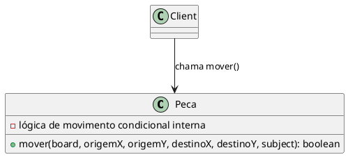

Com o Strategy, encapsulamos as diferentes regras de movimentação em classes separadas. Assim, a peça se torna um contexto que delega a sua operação de movimento à estratégia vigente, permitindo a mudança dinâmica do comportamento sem alterar o código da peça.

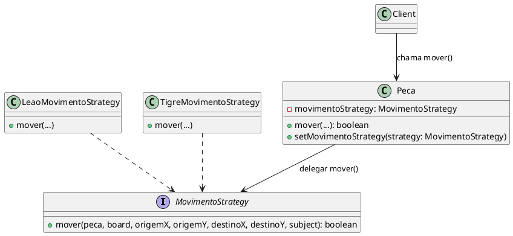

## Estrutura do Padrão (GOF - Papéis)

## Padrão aplicado no cénario

Cada tipo de peça no jogo possui regras de movimentação específicas. Sem o uso do padrão Strategy, a lógica de movimento de todas as peças estaria centralizada em uma única classe ou método, cheia de condicionais para verificar o tipo da peça, o que tornaria o código rígido, difícil de manter e não extensível. Com o padrão Strategy, cada peça recebe uma instância de MovimentoStrategy correspondente, como LeaoMovimentoStrategy, TigreMovimentoStrategy, MovimentoBasicoStrategy, etc. A lógica de movimento fica encapsulada em classes especializadas, e o cliente pode trocar ou configurar comportamentos dinamicamente, sem modificar o código das peças.

### Participantes

| Participante       | Classe no Projeto        | Função                                                                 |
|--------------------|--------------------------|------------------------------------------------------------------------|
| **Strategy**        | `MovimentoStrategy`      | Declara a interface para a estratégia de movimento das peças. Define o método `mover()`. |
| **ConcreteStrategy** | `LeaoMovimentoStrategy`, `ElefanteMovimentoStrategy`, `TigreMovimentoStrategy`, etc. | Implementam o comportamento de movimento específico para cada tipo de peça (Leão, Elefante, Tigre, etc.). |
| **Context**         | `Peca`                   | A peça que utiliza a estratégia de movimento. Define o método `setMovimentoStrategy()` para alterar a estratégia de movimento em tempo de execução. |
| **Client**          | `TabletopBuilder`        | O Builder que configura as peças do jogo e as associa com suas respectivas estratégias de movimento através da fábrica (`SelvaPieceFactory`). |


## Exemplo de Código

#### Strategy - (MovimentoStrategy)
@import "framework-tabuleiro/src/strategy/MovimentoStrategy.java"


#### ConcreteStrategy (LeaoMovimentoStrategy,ElefanteMovimentoStrategy,GatoMovimentoStrategy, LeopardoMovimentoStrategy,LoboMovimentoStrategy,CaoMovimentoStrategy,RatoMovimentoStrategy MovimentoBasicoStrategy, TigreMovimentoStrategy) 
@import "framework-tabuleiro/src/strategy/LeaoMovimentoStrategy.java"
@import "framework-tabuleiro/src/strategy/ElefanteMovimentoStrategy.java"
@import "framework-tabuleiro/src/strategy/GatoMovimentoStrategy.java"
@import "framework-tabuleiro/src/strategy/LeopardoMovimentoStrategy.java"
@import "framework-tabuleiro/src/strategy/LoboMovimentoStrategy.java"
@import "framework-tabuleiro/src/strategy/CaoMovimentoStrategy.java"
@import "framework-tabuleiro/src/strategy/RatoMovimentoStrategy.java"
@import "framework-tabuleiro/src/strategy/TigreMovimentoStrategy.java"

@import "framework-tabuleiro/src/strategy/MovimentoBasicoStrategy.java"


#### Context (Peca)
@import "framework-tabuleiro/src/context/Peca.java"

#### Client (TabletopBuilder)
@import "framework-tabuleiro/src/builder/TabletopBuilder.java"


# 5. Chain Of Responsability 

## Intenção
Evitar o acoplamento do remetente de uma solicitação ao seu receptor, ao dar a mais de um objeto a oportunidade de tratar a solicitação. Encadear os objetos receptores, passando a solicitação ao longo da cadeia até que um objeto a trate.

## Motivação
Em um Framework, a movimentação de uma peça pode depender de múltiplas validações encadeadas: verificar se está dentro dos limites do tabuleiro, se o destino é uma célula válida, se há uma peça ali, se é permitido capturar, se é possível entrar em uma armadilha ou toca, entre outros.

**Sem o padrão Chain of Responsibility:**
- Toda essa lógica de validação estaria dentro da própria peça ou da estratégia de movimento, resultando em códigos monolíticos e com alta complexidade condicional (if/else, switch).

- Seria difícil adicionar ou remover novas regras de forma flexível.

- Regras ficariam acopladas e difíceis de testar isoladamente.


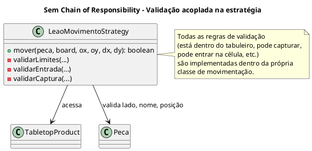

#### Com o uso de Chain of Responsibility:

- Cada validação é encapsulada em um validador independente(ex: DentroDosLimitesValidato,PodeCapturarValidatorPodeEntrarNaTocaValidator, etc.).

- Os validadores são encadeados dinamicamente em uma corrente de responsabilidades.

- A ordem e a composição da cadeia podem ser alteradas ou estendidas sem modificar o código existente.

- Promove abertura para extensão e fechamento para modificação (princípio do Open/Closed).

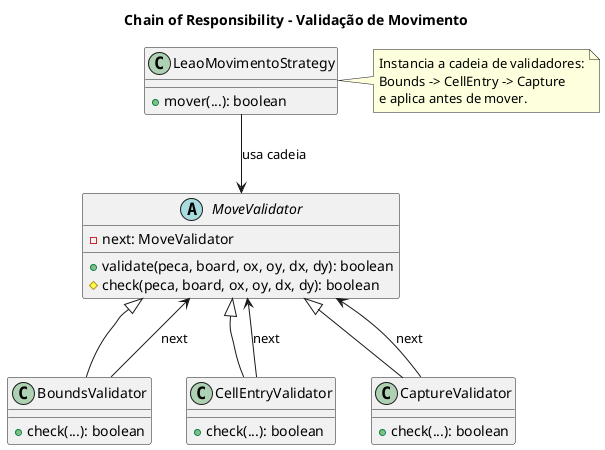

## Estrutura do Padrão (GOF - Papéis)

## Padrão aplicado no cénario

Durante a validação de movimentos no jogo, múltiplas regras precisam ser aplicadas em sequência: se a posição está dentro dos limites, se a célula de destino é válida, se a captura é permitida, etc. Sem o uso de um padrão, todas essas validações estariam dentro de um único método grande e acoplado, provavelmente com uma sequência de ifs que tornaria o código difícil de ler, testar ou modificar.

Com o padrão Chain of Responsibility, essas verificações são transformadas em validadores independentes, como BoundsValidator, CellEntryValidator e CaptureValidator. Cada um encapsula uma regra isolada e pode ser encadeado através de linkWith(), permitindo uma composição flexível da cadeia de validação. Isso facilita a extensão, a reutilização de regras e a manutenção do código, além de separar claramente as responsabilidades.


### Participantes

| Participante           | Classe no Projeto               | Função                                                                                                      |
|------------------------|----------------------------------|-------------------------------------------------------------------------------------------------------------|
| **Handler (abstract)** | `MoveValidator`                 | Declara a interface para validação e mantém uma referência para o próximo validador na cadeia (`next`).    |
| **ConcreteHandler**    | `BoundsValidator`               | Verifica se o destino está dentro dos limites do tabuleiro.                                                |
| **ConcreteHandler**    | `CellEntryValidator`            | Verifica se a peça pode entrar na célula de destino (ex.: evita entrar na própria toca).                   |
| **ConcreteHandler**    | `CaptureValidator`              | Verifica se a peça pode capturar a peça inimiga (ex.: não permitir captura de aliados).                    |
| **Client**             | `LeaoMovimentoStrategy` (e outros `*MovimentoStrategy`) | Cria e encadeia os validadores e os utiliza dentro do método `mover()` para validar a jogada.              |


## Código

#### Handler - (MoveValidator)
@import "framework-tabuleiro/src/responsability/MoveValidator.java"


#### ConcreteHandler (BoundsValidator,CaptureValidator,CellEntryValidator	) 

@import "framework-tabuleiro/src/responsability/CaptureValidator.java"

@import "framework-tabuleiro/src/responsability/CellEntryValidator.java"

@import "framework-tabuleiro/src/responsability/BoundsValidator.java"

#### Context (Peca)
@import "framework-tabuleiro/src/context/Peca.java"

### Client (ConcreteStrategy)


# 6. Flyweight

## Intenção

Usar compartilhamento para suportar eficientemente grandes quantidades de objetos de granularidade fina.

## Motivação
No desenvolvimento de jogos de tabuleiro, o tabuleiro é composto por inúmeros tiles que podem apresentar características idênticas. Por exemplo, várias casas do tabuleiro podem ter o mesmo tipo (água, armadilha, toca, etc.).

Sem o Flyweight, cada tile seria instanciado individualmente, consumindo mais memória e tornando o gerenciamento desses objetos mais complexo.


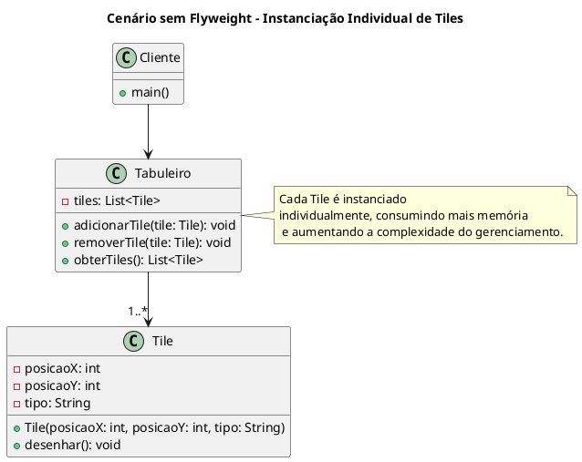

Com o Flyweight, podemos compartilhar instâncias de tiles com estados idênticos, fazendo com que o código cliente não precise criar novas instâncias para cada tile repetido. Assim, o sistema se torna mais leve e eficiente.


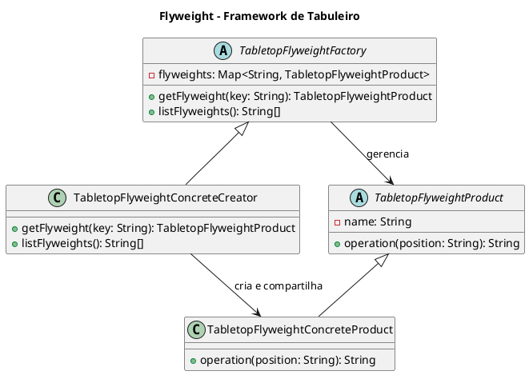

## Estrutura do padrão (GOF - papeis)


## Padrão aplicado no cenário

No tabuleiro, várias células compartilham os mesmos atributos visuais ou comportamentais. Sem o uso do padrão Flyweight, cada célula seria instanciada individualmente, mesmo que idêntica a outras, resultando em desperdício de memória e processamento, especialmente em jogos com grandes áreas de tabuleiro.


Com o padrão Flyweight, objetos como TabletopFlyweightConcreteProduct são reutilizados por meio da TabletopFlyweightFactory, que mantém um cache interno. Quando um componente visual ou estrutural é necessário, a fábrica retorna uma instância compartilhada, evitando recriação desnecessária. Isso otimiza o desempenho e reduz o consumo de memória ao manter apenas uma instância de cada tipo.


  
## Participantes 
| Participante             | Classe no Projeto                      | Função                                                                                                                                                          |
|--------------------------|----------------------------------------|-----------------------------------------------------------------------------------------------------------------------------------------------------------------|
| **Flyweight**            | `TabletopFlyweightProduct`             | Define a interface para os objetos compartilhados (ex: tiles do tabuleiro). Encapsula o estado **intrínseco** (ex: nome do tile) e declara o método `operation()`. |
| **Concrete Flyweight**   | `TabletopFlyweightConcreteProduct`     | Implementa a interface `TabletopFlyweightProduct`. Representa um objeto compartilhado concreto (ex: grama, água, armadilha) e define seu comportamento.          |
| **Flyweight Factory**    | `TabletopFlyweightConcreteCreator`     | Garante o compartilhamento de instâncias `Flyweight`. Cria novos objetos somente se ainda não existirem na memória (uso de cache via `Map`).                   |


## Código 

#### **Concrete Flyweight (TabletopFlyweightConcreteCreator)**
@import "framework-tabuleiro/src/flyweight/TabletopFlyweightConcreteCreator.java"

#### **Flyweight Factory (TabletopFlyweightFactory)**

@import "framework-tabuleiro/src/flyweight/TabletopFlyweightFactory.java"

#### **Flyweight (TabletopFlyweightProduct)**


@import "framework-tabuleiro/src/flyweight/TabletopFlyweightProduct.java"


# 7. Composite

## Intenção

Compor objetos em estruturas de árvore para representarem hierarquias partes-todo. Composite permite aos clientes tratarem de maneira uniforme objetos individuais e composições de objetos.

## Motivação

Ao desenvolver jogos de tabuleiro como o Selva, rapidamente percebemos que o tabuleiro é formado por diversos componentes — células, peças isoladas e grupos de células ou peças que devem ser tratados de forma hierárquica. Sem o Composite, o código cliente acaba precisando:


- Distinguir manualmente entre objetos simples e compostos;
- Iterar por listas heterogêneas de tiles, chamando métodos diferentes para cada tipo;
- Gerir detalhes de montagem e atualização de modo espalhado pelo código, aumentando o acoplamento e a duplicação.
- Isso torna o código verbose e difícil de estender ou manter.

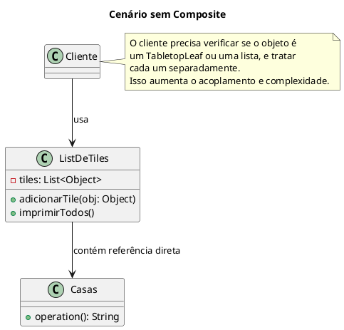

Com o padrão Composite, folhas (tiles individuais) e composições (grupos de tiles) implementam a mesma interface, permitindo que o cliente trate ambos de forma uniforme — basta invocar operation() sem se preocupar com a estrutura interna.


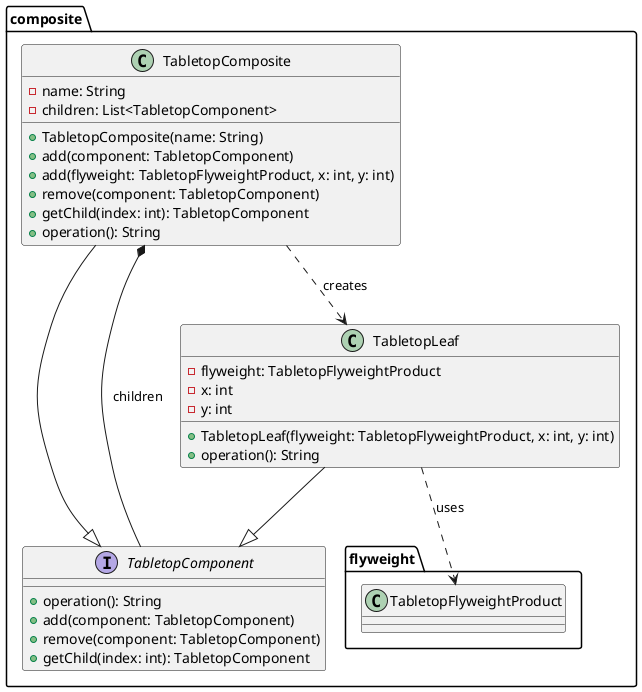

## Estrutura do padrão (GOF - papeis)


## Padrão aplicado no cenário

O TabletopProduct precisa representar uma estrutura hierárquica contendo múltiplos elementos: tiles, células ou até grupos de células. Sem o uso do padrão Composite, seria necessário tratar cada componente individualmente, exigindo verificações manuais e lógicas duplicadas para iterar, renderizar ou interagir com os elementos do tabuleiro.

Com o padrão Composite, criamos a interface TabletopComponent, implementada por TabletopLeaf e TabletopComposite. O tabuleiro pode ser modelado como uma árvore de componentes, em que cada Composite pode conter outros Component. Isso permite que o cliente trate estruturas compostas e elementos individuais de forma uniforme, facilitando operações recursivas como render() e tornando a estrutura extensível.

## Participantes 

| Participante       | Classe no Projeto        | Função                                                                 |
|--------------------|--------------------------|------------------------------------------------------------------------|
| **Component**      | `TabletopComponent`      | Interface comum para objetos folha e compostos. Define o método `operation()`. |
| **Leaf**           | `TabletopLeaf`           | Representa objetos individuais (tiles simples) que não possuem filhos. |
| **Composite**      | `TabletopComposite`      | Representa agrupamentos de componentes. Permite adicionar/remover/acessar filhos e delega operações para eles. |


## Código 


### **TabletopComponent**

@import "framework-tabuleiro/src/composite/composite/TabletopComponent.java"


### **TabletopComposite**

@import "framework-tabuleiro/src/composite/composite/TabletopComposite.java"


### **TabletopLeaf**

@import "framework-tabuleiro/src/composite/composite/TabletopLeaf.java"

# 8. State Pattern

## Intenção

Permite a um objeto alterar seu comportamento quando o seu estado interno muda. O
objeto parecerá ter mudado sua classe.

## Motivação

Suponha que tivéssemos que controlar diretamente os diferentes comportamentos de uma peça (Peca) dentro de um único método, usando estruturas condicionais:

Problemas desta abordagem:

- Código inchado: a cada novo estado (e.g. “Atordoada”, “Empoderada”), precisamos inserir mais if/else no mesmo método.

- Baixa coesão: a classe Peca acumula lógica de todos os comportamentos de estado, além de suas responsabilidades básicas.

- Difícil de estender: mudanças em uma regra de estado podem quebrar outros trechos do mover(), e a Peca torna-se um “deus objeto”.


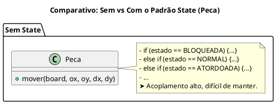

Com o State conseguimos resolver a gestão de comportamentos de peça de forma muito mais modular e flexível. Antes, toda a lógica de “se estiver bloqueada faça X, se estiver normal faça Y, se…”, ficava concentrada num único método mover() de Peca, gerando um emaranhado de if/else difícil de entender e manter.

Com o State Pattern:

- Isolamos cada comportamento de movimento em sua própria classe (NormalState, BloqueadaState, etc.), cada uma implementando apenas o que lhe cabe.

- Eliminamos os condicionais na classe Peca: ela apenas delega ao seu state, sem conhecer detalhes de cada caso.

- Facilitamos a adição de novos estados (por exemplo, AtordoadaState ou EmpoderadaState) sem tocar em código existente, respeitando o princípio Open/Closed.

- Aumentamos a coesão e reduzimos o acoplamento, pois Peca lida só com o contexto (posicionamento, notificação), e os estados cuidam do “se pode mover ou não” e do “como mover”.

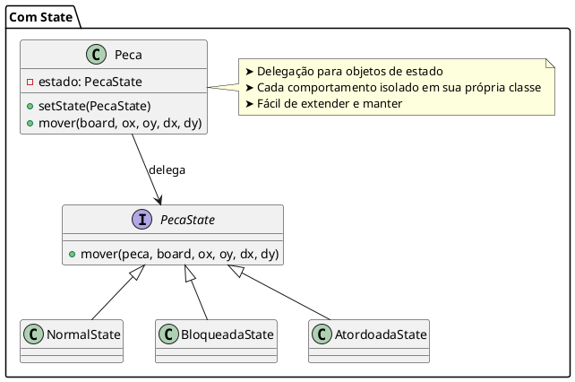

## Padrão aplicado no cenário:

O comportamento de peças e do jogo como um todo varia de acordo com seu estado: uma peça pode estar bloqueada ou normal, e o jogo pode estar iniciado, em progresso ou encerrado. Essas variações seriam controladas com verificações condicionais dispersas (if, switch), espalhadas por múltiplos pontos do código, dificultando a manutenção e adição de novos estados.

Com o State, estados como NormalState, BloqueadaState, InProgressState ou EndedState encapsulam comportamentos específicos e podem ser trocados dinamicamente. A interface (PecaState, GameState) garante que o cliente interaja com qualquer estado de forma uniforme, promovendo extensibilidade e eliminando lógicas condicionais complexas.

## Estrutura

## Participantes

### State Pattern – Ciclo de Vida do Jogo

| Participante       | Classe no Projeto        | Função                                                                                                 |
|--------------------|--------------------------|--------------------------------------------------------------------------------------------------------|
| **State**          | `GameState`              | Interface que define os métodos `start()`, `play()` e `end()` representando os estados do jogo.        |
| **ConcreteState**  | `NotStartedState`, `InProgressState`, `EndedState` | Implementam os comportamentos específicos para cada fase do jogo.                                     |
| **Context**        | `GameController`         | Mantém uma referência para o estado atual (`GameState`) e delega as chamadas aos objetos de estado.   |

---

### State Pattern – Estado das Peças (movimentação)

| Participante       | Classe no Projeto        | Função                                                                                                 |
|--------------------|--------------------------|--------------------------------------------------------------------------------------------------------|
| **State**          | `PecaState`              | Interface que define o comportamento de movimento de uma peça com base em seu estado atual.            |
| **ConcreteState**  | `NormalState`, `BloqueadaState` | Representam estados específicos da peça: ativa ou bloqueada para movimentação.                        |
| **Context**        | `Peca`                   | A peça mantém uma referência ao seu estado atual (`PecaState`) e delega o método `mover()` a ele.     |


## Código

#### State (GameState, PecaState)

@import "framework-tabuleiro/src/state/GameState.java"

@import "framework-tabuleiro/src/state/PecaState.java"


#### ConcreteState (NormalState,BloqueadaState, NotStartedState, InProgressState, EndedState)

@import "framework-tabuleiro/src/state/NormalState.java"

@import "framework-tabuleiro/src/state/BloqueadaState.java"

@import "framework-tabuleiro/src/state/NotStartedState.java"

@import "framework-tabuleiro/src/state/EndedState.java"

#### Context (Peca, GameController)

@import "framework-tabuleiro/src/context/Peca.java"

# 9. FrontController 

## Intenção

Centralizar o controle das requisições em um único ponto de entrada para a aplicação.

## Motivação

Antes de aplicar o padrão, cada comando do usuário era tratado de forma espalhada pelo código:

- A lógica de iniciar o jogo (start) estava em um Main.java.

- O comando move era disparado manualmente via GameFacade.

- O undo e o replay só funcionavam se chamados dentro de métodos específicos.

- Toda a lógica de entrada e validação estava distribuída entre várias classes, como Main, GameFacade e TurnManager.

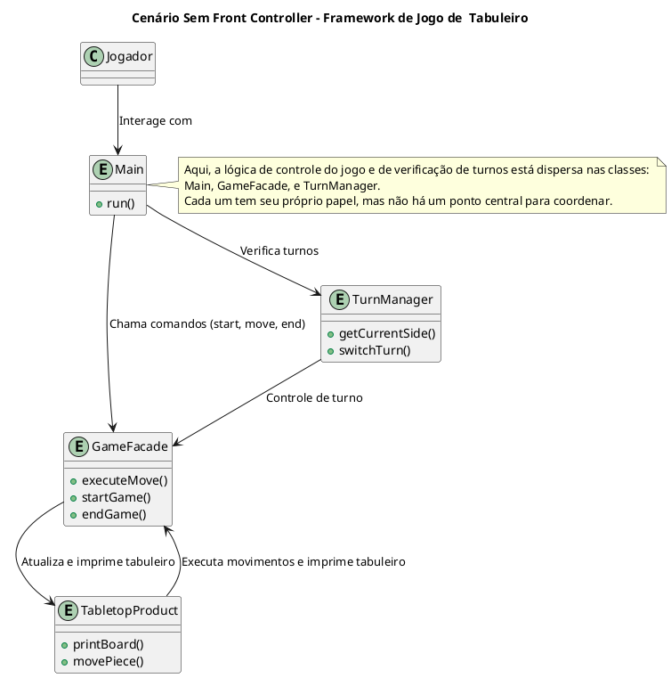

Isso causava os seguintes problemas:

- Duplicação de lógica para verificação de turno, fim de jogo, e atualização de estado.
  
- Baixa coesão: a lógica do ciclo de vida do jogo estava misturada com a lógica de tabuleiro e comandos.

- Dificuldade de escalar: adicionar novos comandos ou alterar o fluxo exigia mudanças em várias partes do sistema.

Como ele resolve o problema:
- Centraliza toda a entrada do usuário no método run() usando o método dispatch(String line).
- Controla o ciclo de vida do jogo com GameState (NotStartedState, InProgressState, EndedState).
- Invoca os comandos apropriados da GameFacade como um mediador.
- Encapsula validação de turno, fim de jogo e impressões do tabuleiro em um só lugar.
- Permite extensões fáceis: para adicionar novos comandos (ex: save, load, help) basta adicionar um novo caso no dispatch().


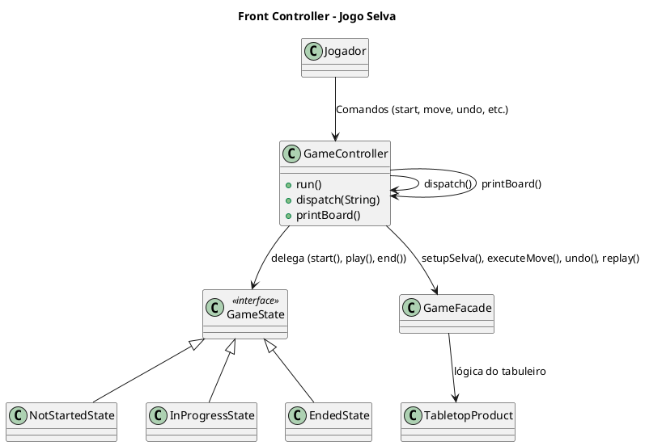

## Padrão no cénario
No nosso framework, aplicamos o padrão Front Controller para resolver um problema de dispersão e acoplamento excessivo entre as classes responsáveis pelo controle do fluxo de jogo. Antes da aplicação do padrão, o código estava desorganizado, com a leitura de comandos, validação de estado e chamada de métodos espalhados por várias classes, como o GameFacade, TurnManager e o próprio Main. Isso causava baixa coesão, pois cada classe estava fazendo mais do que sua responsabilidade principal, como gerenciar o fluxo de comandos ou manipular o estado do jogo. Além disso, o acoplamento era alto, já que diferentes partes do sistema precisavam interagir diretamente entre si para realizar tarefas simples, como mudar o turno ou processar movimentos.

Com a introdução do Front Controller, centralizamos o controle de todos os comandos do jogo no GameController, que se tornou o ponto único de entrada para as requisições do usuário. Este controlador lê os comandos de texto, valida e os direciona para os métodos apropriados, como iniciar o jogo, movimentar peças ou verificar vitórias. Ele também integra o uso do State Pattern, delegando a lógica de mudança de estado do jogo para objetos de estado dedicados, como NotStartedState, InProgressState e EndedState. Esse design permite que cada fase do jogo (início, progresso e fim) seja tratada de forma independente e bem organizada, com a execução centralizada no GameController.

A grande vantagem de aplicar o Front Controller é a maior coesão e a flexibilidade que ele proporciona ao sistema. Agora, o fluxo de jogo é facilmente controlado e estendido, sem a necessidade de mudanças complexas em várias classes. A introdução de novos comandos, como save ou load, se torna uma tarefa simples de implementar, bastando adicionar um novo case no método de despacho de comandos (dispatch()) do GameController. Isso reduz drasticamente o acoplamento entre as classes e facilita a manutenção e o entendimento do código. Em resumo, o Front Controller ajuda a organizar o fluxo de controle, mantendo o código limpo, modular e mais fácil de escalar.

## Estrutura

## Participantes
| Participante            | Classe no Projeto                          | Função                                                                                           |
|-------------------------|--------------------------------------------|--------------------------------------------------------------------------------------------------|
| **Front Controller**    | `GameController`                           | Classe principal que recebe os comandos do usuário e os direciona corretamente.                 |
| **Dispatcher**          | `dispatch(String commandLine)`             | Analisa o comando digitado e invoca a ação apropriada (`start`, `move`, `undo`, `replay`, etc). |
| **Handler / Controller**| `GameState` e subclasses (`NotStartedState`, `InProgressState`, `EndedState`) | Encapsulam os comportamentos específicos de cada estado do jogo.                                |
| **View**                | `printBoard()`                             | Apresenta o estado atual do tabuleiro no console para o jogador.                                |
| **Model**               | `GameFacade`, `TabletopProduct`, etc.      | Representam os dados do jogo e encapsulam a lógica de negócio.                                  |

## Código
#### Front Controller (GameController)

@import "framework-tabuleiro/src/controller/GameController.java"

#### Dispatch (GameController)

@import "framework-tabuleiro/src/controller/GameController.java"

#### Handler / Controller (GameState,InProgressState,NotStarted)

@import "framework-tabuleiro/src/state/GameState.java"

@import "framework-tabuleiro/src/state/InProgressState.java"

@import "framework-tabuleiro/src/state/NotStartedState.java"

#### View (GameController)

@import "framework-tabuleiro/src/controller/GameController.java"

#### Model  (GameFacade)

@import "framework-tabuleiro/src/facade/GameFacade.java"

# 10. Command Pattern

## Intenção

Encapsular uma solicitação como um objeto, desta forma permitindo parametrizar clientes com diferentes solicitações, enfileirar ou fazer o registro (log) de solicitações e suportar operações que podem ser desfeitas

## Motivação

Em um framework de jogo de tabuleiro, sem o padrão Command o cliente (por exemplo, a interface de usuário) teria que chamar diretamente métodos das peças (ex.: `mover()`). Isso leva a algumas dificuldades:

- **Acoplamento Elevado:** O cliente precisaria conhecer os detalhes da implementação e do receptor, tornando difícil modificar a lógica ou substituir funcionalidades.
- **Dificuldade para Log e Replay:** Sem o encapsulamento, registrar as jogadas e reproduzi-las (replay) exigiria lógica repetitiva e espalhada.
- **Complexidade no Suporte a Undo/Redo:** Sem Command, implementar desfazer e refazer operações demandaria que a lógica de reversão estivesse presente em vários pontos da aplicação.

Com o Command, cada ação do jogo (como mover uma peça) é encapsulada em um objeto comando. Isso possibilita registrar, enfileirar, reexecutar e, futuramente, desfazer ações sem que o cliente precise entender os detalhes da implementação.

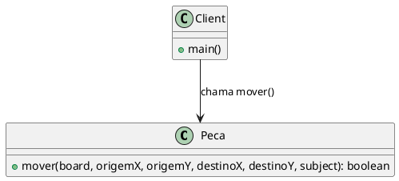

Com o padrão Command, o processo de execução torna-se independente do receptor. O cliente simplesmente invoca o comando, que registra e executa a ação, possibilitando o registro para replay e suporte a undo/redo (se implementado).

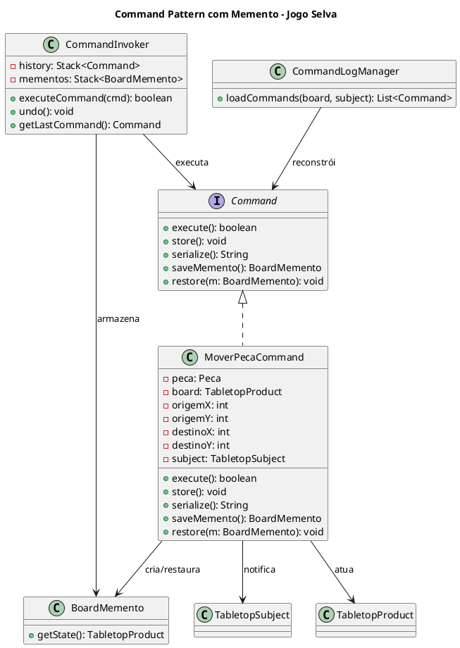
## Estrutura do Padrão (GOF - Papéis)

## Padrão no Cenário

A movimentação de peças no jogo exige que comandos encapsulem ações como “mover peça de A para B”. Essa lógica estaria espalhada em vários lugares do sistema, exigindo que controladores ou interfaces manipulassem diretamente os objetos do jogo, alterando estados sem controle centralizado e dificultando a extensão (ex: histórico de ações ou desfazer).

O padrão Command, ajuda a realizar ações como mover uma peça que são encapsuladas em objetos como MoverPecaCommand, que implementam a interface Command. Esses objetos podem ser passados ao CommandInvoker para execução, e registrados no CommandLogManager para histórico. Isso permite adicionar, desfazer ou registrar comandos de forma desacoplada, promovendo flexibilidade e controle centralizado sobre as operações do jogo.

### Participantes

| Participante         | Classe no Projeto        | Função                                                                                                  |
|----------------------|--------------------------|---------------------------------------------------------------------------------------------------------|
| **Command**          | `Command`                | Interface que define as operações que todos os comandos devem implementar: `execute`, `store`, `serialize`, `saveMemento`, `restore`. |
| **ConcreteCommand**  | `MoverPecaCommand`       | Implementa o comando de movimentação de peça. Executa a lógica de movimento e salva/restaura estado com Memento. |
| **Invoker**          | `CommandInvoker`         | Gerencia a execução dos comandos. Mantém o histórico para desfazer (`undo`) e acessa o último comando (`getLastCommand`). |
| **Receiver**         | `Peca`, `TabletopProduct`| Os objetos que realizam a ação de fato (mover a peça, alterar o tabuleiro).                            |
| **Client**           | `GameController`         | Cria o comando, configura os parâmetros e o envia ao `CommandInvoker` para execução.                   |
| **Memento**          | `BoardMemento`           | Armazena o estado anterior do tabuleiro para permitir desfazer (`undo`).                               |
| **Caretaker**        | `CommandInvoker`         | Guarda os mementos dos comandos executados e os utiliza para restaurar o estado.                       |
| **Command Logger**   | `CommandLogManager`      | Responsável por registrar os comandos executados e reconstruí-los posteriormente a partir de um log.   |

  
## Exemplo de Código: 

#### Command

@import "framework-tabuleiro/src/command/Command.java"


#### MoverPecaCommand – ConcreteCommand
@import "framework-tabuleiro/src/command/MoverPecaCommand.java"


#### CommandInvoker – Invoker
@import "framework-tabuleiro/src/command/CommandInvoker.java"


#### CommandLogManager – Client Helper
@import "framework-tabuleiro/src/command/CommandLogManager.java"

#### Command Logger	-  CommandLogManager
 
 @import "framework-tabuleiro/src/command/CommandLogManager.java"

#### Peca / TabletopProduct – Receiver
@import "framework-tabuleiro/src/context/Peca.java"
@import "framework-tabuleiro/src/builder/TabletopProduct.java"


#### GameController – Client
@import "framework-tabuleiro/src/controller/GameController.java"


# 11. Memento

## Intenção

Sem violar o encapsulamento, capturar e externalizar um estado interno de um objeto, de maneira que o objeto possa ser restaurado para esse estado mais tarde.

## Motivação

Imagine que você esteja desenvolvendo um framework de jogo de tabuleiro onde os jogadores podem mover peças, desfazer jogadas (undo) ou até repetir uma sequência de jogadas (replay).

Sem um mecanismo adequado para armazenar o estado anterior do tabuleiro, você teria dois grandes problemas:

- Desfazer movimentos seria difícil ou impreciso: Para reverter uma jogada, seria necessário manter manualmente diversas variáveis (posição anterior da peça, peça capturada, etc.), o que tornaria o código mais complexo e propenso a erros.

- Não há histórico confiável de estados: O tabuleiro mudaria a cada jogada, e qualquer tentativa de registrar o estado anterior envolveria duplicação de lógica ou cópias manuais de atributos.

- Alto acoplagem: O Command teria que lidar com lógica de restauração diretamente, acoplando regras de jogo com persistência de estado, dificultando manutenção e testes.

```plantuml
@startuml
title Sem o padrão Memento

interface Command {
    + execute(): boolean
}

class MoverPecaCommand {
    - estadoAnterior: TabletopProduct
    - peca: Peca
    - board: TabletopProduct
    + execute(): boolean
    + restore(): void
}

Command <|.. MoverPecaCommand

MoverPecaCommand --> TabletopProduct : manipula e salva estado
MoverPecaCommand --> Peca : move

note right of MoverPecaCommand
Estado é salvo dentro da própria classe,
gerando acoplamento e complexidade.
end note
@enduml
```

Com a introdução do padrão Memento, cada comando (MoverPecaCommand, por exemplo) captura automaticamente o estado do tabuleiro antes da execução e o armazena de forma encapsulada:

```plantuml
@startuml
title Com o padrão Memento - framework Selva

interface Command {
    + execute(): boolean
    + saveMemento(): BoardMemento
    + restore(m: BoardMemento): void
}

class MoverPecaCommand {
    - peca: Peca
    - board: TabletopProduct
    - origemX, origemY, destinoX, destinoY: int
    - subject: TabletopSubject
    + execute(): boolean
    + saveMemento(): BoardMemento
    + restore(m: BoardMemento): void
}

class BoardMemento {
    - snapshot: TabletopProduct
    + getState(): TabletopProduct
}

Command <|.. MoverPecaCommand
MoverPecaCommand --> Peca : move
MoverPecaCommand --> BoardMemento : cria/usa
BoardMemento --> TabletopProduct : encapsula estado

note right of BoardMemento
Encapsula o estado do tabuleiro antes da ação.
Permite desfazer ou restaurar sem acoplamento.
end note

@enduml

```

## Estrutura do GOF

## Padrão aplicado no cénario: 

Durante uma partida, pode ser necessário salvar o estado atual do tabuleiro para restaurá-lo depois (por exemplo, para implementar “desfazer” ou checkpoints). Sem o padrão Memento, o cliente teria que acessar diretamente os atributos internos do tabuleiro e copiá-los manualmente, violando o encapsulamento e aumentando o risco de inconsistência.

Com o padrão Memento, a classe BoardMemento encapsula o estado do TabletopProduct sem expor sua estrutura interna. O cliente pode criar um snapshot do estado e restaurá-lo posteriormente, mantendo a integridade do objeto original. Isso permite salvar e restaurar estados de forma segura, reutilizável e desacoplada

## Participantes

| Participante         | Classe no Projeto           | Função                                                                                          |
|----------------------|-----------------------------|--------------------------------------------------------------------------------------------------|
| **Originator**       | `TabletopProduct`           | Objeto que possui o estado interno que será salvo e restaurado. Oferece métodos para gerar e restaurar mementos. |
| **Memento**          | `BoardMemento`              | Armazena o estado interno do `TabletopProduct` de forma segura, sem expor sua estrutura.         |
| **Caretaker**        | `CommandInvoker`            | Responsável por armazenar e recuperar mementos sem modificá-los ou interpretá-los.               |
| **Client**           | `MoverPecaCommand`          | Gera o memento antes de executar um comando e solicita restauração se necessário (ex: undo).     |


## Código

#### Originator (TabletopProduct)
@import "framework-tabuleiro/src/builder/TabletopProduct.java"

#### Memento – BoardMemento
@import "framework-tabuleiro/src/memento/BoardMemento.java"

#### Caretaker – CommandInvoker
@import "framework-tabuleiro/src/command/CommandInvoker.java"

#### Client – MoverPecaCommand
@import "framework-tabuleiro/src/command/MoverPecaCommand.java"


# 12. Observer

## Intenção

Definir uma dependência um-para-muitos entre objetos, de maneira que quando um
objeto muda de estado todos os seus dependentes são notificados e atualizados
automaticamente

## Motivação

Em um framework de jogo de tabuleiro, diversas partes do sistema podem precisar reagir a alterações no estado do jogo, como atualizações na pontuação, mudança de turno ou alterações no estado do tabuleiro. Sem o Observer Pattern, cada componente precisaria interrogar constantemente o estado do jogo ou ser explicitamente atualizado por métodos diretos, aumentando o acoplamento e a complexidade do código.
```plantuml
@startuml
title UML - Sem Observer Pattern

class GameController {
  - state: String
  - display: Display
  - scoreBoard: ScoreBoard
  + setState(newState: String): void
}

class Display {
  + update(data: String): void
}

class ScoreBoard {
  + update(data: String): void
}

GameController --> Display : "chama update()"
GameController --> ScoreBoard : "chama update()"
@enduml
```

Com o Observer Pattern, o sujeito central (por exemplo, um controlador de estado do jogo) notifica automaticamente todos os observadores registrados assim que seu estado muda, garantindo que a interface do usuário, o sistema de pontuação e outros módulos recebam as atualizações em tempo real e de forma desacoplada.

```plantuml
@startuml
title Observer Pattern para Jogo de Tabuleiro

interface TabletopObserver {
  + update(data: String): void
}

abstract class TabletopSubject {
  + attach(observer: TabletopObserver): void
  + detach(observer: TabletopObserver): void
  + notifyObservers(data: String): void
}

class TabletopConcreteSubject {
  - observers: List<TabletopObserver>
  - state: String
  + TabletopConcreteSubject(initialState: String)
  + setState(newState: String): void
  + attach(observer: TabletopObserver): void
  + detach(observer: TabletopObserver): void
  + notifyObservers(data: String): void
}

class TabletopConcreteObserver {
  - name: String
  + TabletopConcreteObserver(name: String)
  + update(data: String): void
}

TabletopConcreteSubject ..|> TabletopSubject
TabletopConcreteObserver ..|> TabletopObserver

TabletopConcreteSubject --> TabletopObserver : "notifica"
@enduml
```

## Estrutura do Padrão (GOF - Papéis)


## Participantes

- **Observer (TabletopObserver):**
  - Define a interface para os observadores que desejam receber atualizações.
  - Declara o método `update(String data)`, que será chamado pelo sujeito quando ocorrer uma mudança de estado.

- **Subject (TabletopSubject):**
  - Define a interface ou classe abstrata para o sujeito observado.
  - Declara os métodos `attach(TabletopObserver observer)`, `detach(TabletopObserver observer)` e `notifyObservers(String data)`, responsáveis por gerenciar os observadores e disseminar atualizações.

- **ConcreteSubject (TabletopConcreteSubject):**
  - Implementa a classe abstrata `TabletopSubject` e mantém o estado interno do objeto.
  - Quando seu estado é alterado (por meio do método `setState(String newState)`), ele notifica todos os observadores registrados.

- **ConcreteObserver (TabletopConcreteObserver):**
  - Implementa a interface `TabletopObserver`.
  - Define o comportamento do observador quando uma atualização é recebida, por exemplo, exibindo a mensagem de atualização no console.
  
## Código

### **TabletopConcreteObserver**
@import "framework-tabuleiro/src/observer/TabletopConcreteObserver.java"


### **TabletopConcreteSubject**
@import "framework-tabuleiro/src/observer/TabletopConcreteSubject.java"

### **TabletopObserver**

@import "framework-tabuleiro/src/observer/TabletopObserver.java"
### **TabletopSubject**

@import "framework-tabuleiro/src/observer/TabletopSubject.java"

# 13. Singleton

## Intenção

Garantir que uma classe tenha somente uma instância e fornecer um ponto global de acesso para a mesma

## Motivação

Imagine um cenário onde diversas partes do framework de um jogo de tabuleiro precisam acessar o lado do jogador atual para decidir se um movimento é válido, alternar turnos, ou atualizar mensagens no console. Suponha que você tenha um método getCurrentSide() que retorna se é a vez do jogador branco ou do jogador preto.

Agora pense que, sem nenhum controle central, cada componente — como GameController, GameFacade, Peca, ou Command — cria sua própria instância de TurnManager.

Nesse cenário, temos múltiplas instâncias de TurnManager, e cada uma armazena um valor diferente de turno. O GameController pode acreditar que é a vez do branco, enquanto a GameFacade acredita que é a do preto, causando comportamentos errados, como:

- Jogadores realizando dois turnos seguidos;

- Validações incorretas de jogada ("não é sua vez");

- Dificuldade para fazer undo/replay corretamente com base no jogador.

- Além disso, essa abordagem viola princípios como coesão e baixo acoplamento, pois o estado do jogo se dispersa entre objetos soltos.

```plantuml
@startuml
title Sem Singleton - Problema com TurnManager duplicado

class TurnManager {
    - currentPlayer: PlayerSide
    + getCurrentSide(): PlayerSide
    + switchTurn(): void
}

class GameController {
    - turnManager: TurnManager
}

class GameFacade {
    - turnManager: TurnManager
}

class Peca {
    - turnManager: TurnManager
}

GameController --> TurnManager : instancia própria
GameFacade --> TurnManager : instancia própria
Peca --> TurnManager : instancia própria

note right of TurnManager
Sem Singleton, cada classe cria sua
própria instância de TurnManager,
gerando estados inconsistentes.
end note
@enduml
```


Aplicando o padrão Singleton à classe TurnManager, garantimos que existe apenas uma única instância acessível globalmente. Com isso:

- Toda parte do sistema acessa a mesma instância com TurnManager.getInstance();

- O lado atual do jogador (PlayerSide) é sempre consistente;

- A troca de turnos com switchTurn() afeta imediatamente todas as áreas do jogo;

- Reduzimos a complexidade e melhoramos a manutenibilidade do sistema.

```plantuml
@startuml
title Com Singleton - TurnManager centralizado

class TurnManager {
    - static instance: TurnManager
    - currentPlayer: PlayerSide
    + getInstance(): TurnManager
    + getCurrentSide(): PlayerSide
    + switchTurn(): void
}

class GameController {
    - turnManager: TurnManager
}

class GameFacade {
    - turnManager: TurnManager
}

class Peca {
    - turnManager: TurnManager
}

GameController --> TurnManager : getInstance()
GameFacade --> TurnManager : getInstance()
Peca --> TurnManager : getInstance()

note right of TurnManager
Com Singleton, todos acessam
a mesma instância, garantindo
sincronia no turno atual.
end note
@enduml
```

## Estrutura do Padrão - GOF

## Padrão aplicado no cénario
Alguns componentes do jogo, como TurnManager e GameController, precisam existir como instâncias únicas em todo o sistema para manter consistência global. Sem o padrão Singleton, seria possível instanciar múltiplos gerenciadores de turno ou controladores, o que poderia levar a estados divergentes, conflitos de responsabilidade e comportamento imprevisível.

Com o padrão Singleton, essas classes controlam sua própria instância por meio de um método getInstance() e um construtor privado. Isso garante que apenas uma instância seja criada e compartilhada, centralizando o controle de estado e comportamento. O acesso global simplifica o uso e preserva a integridade do jogo.


## Participantes

| Participante       | Classe no Projeto      | Função                                                                                             |
|--------------------|------------------------|----------------------------------------------------------------------------------------------------|
| **Singleton**      | `TurnManager`          | Garante que apenas uma instância do gerenciador de turnos exista no sistema.                      |
| **Client**         | `GameController`, `GameFacade`, `Peca` | Utilizam `TurnManager.getInstance()` para acessar o turno atual e alternar jogadores de forma centralizada. |


## Código
#### Singleton (TurnManager)
@import "framework-tabuleiro/src/singleton/TurnManager.java"

#### Client (GameController, GameFacade, Peca)
@import "framework-tabuleiro/src/controller/GameController.java"
@import "framework-tabuleiro/src/facade/GameFacade.java"
@import "framework-tabuleiro/src/context/Peca.java"

# 14. Facade

## Intenção

Fornecer uma interface unificada para um conjunto de interfaces em um subsistema. Facade define uma interface de nível mais alto que torna o subsistema mais fácil de ser usado

## Motivação

Imagine um cenário onde estamos  desenvolvendo o jogo de tabuleiro, nesse caso é preciso montar e iniciar o jogo da Selva diretamente a partir de diversas classes: TabletopBuilder, TabletopDirector, SelvaCellCreator, SelvaPieceFactory, TabletopFlyweightConcreteCreator, além de lidar manualmente com o padrão Observer para notificar alterações no estado do jogo.

A complexidade disso se torna evidente: o cliente (por exemplo, o GameController ou a classe Main) precisa conhecer detalhes de implementação de múltiplos padrões de projeto e orquestrar manualmente cada passo da construção e inicialização do tabuleiro. Isso gera um alto acoplamento, código repetitivo e difícil de manter.

```plantuml
@startuml
title Sem o padrão Facade - Cliente exposto a múltiplas dependências


class TabletopBuilder {
  +withDimensions()
  +buildCells()
  +buildTiles()
  +buildPieces()
  +getResult()
}
class TabletopDirector {
  +construct()
}
class SelvaCellCreator
class SelvaPieceFactoryImpl
class TabletopFlyweightConcreteCreator
class TabletopProduct

Cliente --> TabletopBuilder : configura dimensões
Cliente --> SelvaCellCreator : cria células
Cliente --> TabletopFlyweightConcreteCreator : cria tiles
Cliente --> SelvaPieceFactoryImpl : cria peças
Cliente --> TabletopDirector : coordena montagem
TabletopDirector --> TabletopBuilder
TabletopBuilder --> TabletopProduct : getResult()

note right of Cliente
O cliente precisa orquestrar todas
as dependências do sistema manualmente.
Isso aumenta o acoplamento e a complexidade.
end note
@enduml
```


Com o padrão Facade, conseguimos resolver essa dificuldade de forma simples e organizada:
Criamos a classe GameFacade, que encapsula toda essa complexidade de inicialização e orquestração de componentes internos do framework. Com isso, o cliente precisa apenas chamar métodos como setupSelva() ou executeMove() sem se preocupar com os detalhes internos da construção do tabuleiro ou do sistema de eventos.

A GameFacade atua como uma interface unificada e de alto nível, facilitando a interação com o sistema e tornando o código mais limpo, legível e de fácil manutenção. Além disso, ela facilita o uso combinado de vários padrões (como Builder, Abstract Factory, Observer, Command etc.) sem expor sua complexidade ao usuário final.


```plantuml
@startuml
title Com o padrão Facade - Cliente interage com GameFacade


class GameFacade {
  +setupSelva()
  +divideBoard()
  +executeMove()
  +getBoard()
}

class TabletopBuilder
class TabletopDirector
class TabletopProduct
class SelvaCellCreator
class TabletopFlyweightConcreteCreator
class SelvaPieceFactoryImpl

Cliente --> GameFacade : chama setupSelva()
GameFacade --> TabletopBuilder
GameFacade --> TabletopDirector
GameFacade --> SelvaCellCreator
GameFacade --> TabletopFlyweightConcreteCreator
GameFacade --> SelvaPieceFactoryImpl
GameFacade --> TabletopProduct : getBoard()

note right of GameFacade
Centraliza toda a lógica e dependências
para simplificar o uso pelo cliente.
end note

@enduml
```
## Estrutura do Padrão - GOF

## Padrão utilizado no cenário

O sistema de jogo envolve múltiplos subsistemas interdependentes: construção do tabuleiro com Builder, execução de comandos, controle de turnos, aplicação de estratégias de movimento, validações e notificações via Observer. Sem um ponto de entrada unificado, o cliente teria que instanciar e coordenar todos esses módulos manualmente, o que geraria um código altamente acoplado e difícil de manter.

Com o padrão Facade, a classe GameFacade encapsula toda a lógica de inicialização e interação entre os módulos internos. Ela fornece métodos simples como construirTabuleiro(), moverPeca(), dividirTabuleiroComTemplate() e notificarMudanca(), escondendo a complexidade da composição do sistema. Isso simplifica o uso da aplicação e facilita a integração com interfaces externas ou clientes de alto nível.

## Participantes

## Código

#### Facade - GameFacade
@import "framework-tabuleiro/src/facade/GameFacade.java"

#### Subsistemas - TabletopBuilder, TabletopDirector, SelvaPieceFactoryImpl, SelvaCellCreator, TabletopFlyweightConcreteCreator,CommandInvoker

@import "framework-tabuleiro/src/builder/TabletopBuilder.java"

@import "framework-tabuleiro/src/builder/TabletopDirector.java"

@import "framework-tabuleiro/src/abstractfactory/SelvaPieceFactoryImpl.java"

@import "framework-tabuleiro/src/factorymethod/SelvaCellCreator.java"

@import "framework-tabuleiro/src/flyweight/TabletopFlyweightConcreteCreator.java"

@import "framework-tabuleiro/src/command/CommandInvoker.java"

#### Cliente (GameController, Main)

@import "framework-tabuleiro/src/controller/GameController.java"
@import "framework-tabuleiro/src/Main.java"


# 15. Prototype 

## Intenção

Especificar os tipos de objetos a serem criados usando uma instância-protótipo e criar novos objetos pela cópia desse protótipo.

## Motivação

Em cenários onde os objetos a serem criados são complexos – como um tabuleiro de jogo com uma série de componentes e configurações – a criação direta por meio de um construtor pode ser ineficiente e resultar em código redundante. 

```plantuml
@startuml
title UML - Antes da Aplicação do Prototype

class TabletopProduct {
  - x: int
  - y: int
  - tiles: List<TabletopComponent>
  + TabletopProduct(x: int, y: int, tiles: List<TabletopComponent>)
  + getX(): int
  + getY(): int
  + getTiles(): List<TabletopComponent>
}

class Client {
  + main(args: String[]): void
}

Client --> TabletopProduct : "new instance"
@enduml
```
Sem o uso do Prototype, cada vez que um objeto complexo precisasse ser replicado, seria necessário chamar o construtor com todos os seus parâmetros, o que poderia levar a erros e dificultar a manutenção.

```plantuml
@startuml
title Prototype Pattern para TabletopProduct

interface TabletopPrototype {
  + clonePrototype(): TabletopPrototype
}

class TabletopConcretePrototype {
  - product: TabletopProduct
  + TabletopConcretePrototype(product: TabletopProduct)
  + clonePrototype(): TabletopPrototype
  + getProduct(): TabletopProduct
}

TabletopConcretePrototype ..|> TabletopPrototype
TabletopConcretePrototype --> TabletopProduct
@enduml
```

Utilizando o Prototype, o framework pode gerar novas instâncias de um objeto complexo por meio da clonagem de um protótipo previamente configurado. Essa abordagem simplifica a criação de cópias, diminui o acoplamento com classes concretas e torna o sistema mais flexível para alterações futuras, além de melhorar a performance em operações onde a criação completa do objeto seria muito custosa.

## Padrão aplicado no cenário
No nosso cenário, estamos construindo um tabuleiro que pode ser composto por peças individuais ou agrupamentos de peças. Ao aplicar o padrão Composite, conseguimos manipular esses elementos de forma hierárquica e uniforme, facilitando operações complexas como movimentação, remoção ou adição de peças no tabuleiro.

## Estrutura do Padrão (GOF - Papéis)


## Participantes do Padrão Prototype

| Participante         | Classe no Projeto             | Função                                                                                                          |
|----------------------|-------------------------------|-----------------------------------------------------------------------------------------------------------------|
| **Prototype**        | `TabletopPrototype`           | Interface que define o contrato para clonagem. Declara o método `clonePrototype()`.                            |
| **ConcretePrototype**| `TabletopConcretePrototype`   | Implementa `TabletopPrototype`. Armazena e clona uma instância de `TabletopProduct`, retornando uma cópia.     |
| **Product**          | `TabletopProduct`             | Objeto complexo clonado pelo protótipo. Representa o tabuleiro com células, peças e tiles.                     |


## Padrão usado no cénario: 

Em alguns momentos do jogo, é necessário duplicar completamente a estrutura de um tabuleiro (TabletopProduct) — por exemplo, para salvar variações de estado, testar jogadas ou criar tabuleiros com pequenas diferenças. Sem o uso do padrão Prototype, seria preciso reconstruir manualmente o objeto, copiando profundamente todas as suas propriedades, o que é complexo, repetitivo e propenso a erros.

Com o padrão Prototype, TabletopConcretePrototype implementa um método clone() que encapsula a lógica de duplicação completa do tabuleiro. O cliente pode clonar instâncias de forma segura e sem conhecer a estrutura interna do objeto. Isso facilita a criação de cópias consistentes e reaproveitamento de configurações complexas.

## Código

### **TabletopPrototype**

@import "framework-tabuleiro/src/prototype/TabletopPrototype.java"

### **TabletopConcretePrototype**

@import "framework-tabuleiro/src/prototype/TabletopConcretePrototype.java"


# Como Usar o Framework para Construir outros Jogos – Exemplo: Jogo de Xadrez

Este framework foi projetado com base em padrões de projeto para permitir a criação modular e reutilizável de jogos de tabuleiro. A seguir, apresentamos um guia passo a passo para integrar um novo jogo—neste caso, **Xadrez**—ao framework.

---

## 1. Implementar o Builder do Tabuleiro

1. **Criar** a classe `XadrezTabletopBuilder` que estenda `TabletopBuilder` e implemente:
   - `withDimensions(int width, int height)`: define 8×8.
   - `buildCells(CellCreator cellFactory, TabletopFlyweightFactory flyFactory)`: preenche a matriz de células.
   - `buildTiles(TabletopFlyweightFactory flyFactory)`: cria o tabuleiro visual (casas brancas e pretas alternadas).
   - `buildPieces(SelvaPieceFactory pieceFactory)`: posiciona as peças nas casas iniciais.

2. **Exemplo de esqueleto**:
   ```java
   public class XadrezTabletopBuilder extends TabletopBuilder {
       @Override
       public TabletopBuilder buildCells(CellCreator cellFactory, TabletopFlyweightFactory flyFactory) {
           // inicializa cells[y][x] usando cellFactory.createCell(...)
           return this;
       }

       @Override
       public TabletopBuilder buildTiles(TabletopFlyweightFactory flyFactory) {
           // percorre cells[][], chama render() e adiciona TabletopLeaf
           return this;
       }

       @Override
       public TabletopBuilder buildPieces(SelvaPieceFactory pieceFactory) {
           // usa pieceFactory para criar peças de xadrez nas posições iniciais
           return this;
       }
   }
   ```

3. **Montagem**:

```java
TabletopDirector director = new TabletopDirector(new XadrezTabletopBuilder());
TabletopProduct tabuleiroXadrez = director
    .withDimensions(8, 8)
    .buildCells(new XadrezCellCreator(), flyFactory)
    .buildTiles(flyFactory)
    .buildPieces(new XadrezPieceFactoryImpl())
    .getResult();

```
## 2. Criar a Abstract Factory das Peças

1. Definir XadrezPieceFactory (interface) com métodos
2. Implementar XadrezPieceFactoryImpl que, em cada método, invoque um método protegido createPiece(name, side, strategy, startPos) para instanciar e posicionar cada peça.

## 3. Implementar as Estratégias de Movimento (Strategy)

```java
public class CavaloMovimentoStrategy implements MovimentoStrategy {
    @Override
    public boolean mover(Peca peca,
                         TabletopProduct board,
                         int ox, int oy,
                         int dx, int dy,
                         TabletopSubject subj) {
        // valida padrão “L” e invoca board.movePiece(...)
    }
}
```

- Rei: movimentos de 1 casa em todas as direções.
- Rainha: combina movimentos de torre e bispo.
- Bispo, Torre, Peão, etc.

## 4. Validar Regras de Movimento (Chain of Responsibility)

Encadeie validadores para isolar cada regra:

```java
MoveValidator chain =
    new BoundsValidator(
      new EmptyOrEnemyValidator(
        new CheckStateValidator(null)));
if (!chain.validate(peca, board, ox, oy, dx, dy)) return false;

```

- BoundsValidator: verifica limites do tabuleiro.
- EmptyOrEnemyValidator: só permite casas vazias ou inimigas.
- CheckStateValidator: impede movimento que colocaria o rei em xeque.

## 5. Controlador de Jogo (Front Controller + State)
Implemente XadrezController (ou use GameController) que:

Recebe comandos do console:

- start
- move ox oy dx dy
- undo
- replay
- end

Gerencia o estado com o State Pattern (NotStartedState, InProgressState, EndedState).
Controla turnos via TurnManager (Singleton).
Invoca GameFacade para executar movimentos, desfazer (undo) ou repetir (replay).

## 6. Notificações de Interface (Observer). Use TabletopConcreteSubject e TabletopConcreteObserver para receber eventos

## 7. Crie uma Facade
Crie XadrezFacade com métodos de alto nível

```java
public class XadrezFacade {
    void iniciarPartida();
    boolean realizarJogada(int ox, int oy, int dx, int dy);
    void desfazer();
    void reexecutar();
    TabletopProduct obterEstado();
}
```
