# Construção do Jogo Selva - Framework de Tabuleiro

A Selva é um antigo jogo indiano, também conhecido como Xadrez da Selva (no entanto, por ter muitas diferenças, não é incluído na categoria dos jogos de Xadrez). Joga-se num tabuleiro de 7 x 9 que contém casas com água (azuis), tocas (a negro) e armadilhas (magenta).

## Contexto do Projeto: 

Elaborar um framework, com no mínimo 12 dos padrões de projetos vistos na disciplina (com no mínimo 3 de cada grupo), para a construção de um jogo de tabuleiro nos moldes de JogoSelva.

## Resumo - Padrões Utilizados no Framework: 

| Padrão                | Intenção                                                                                                                                       | Uso no Projeto                                                                                                       |
|-----------------------|------------------------------------------------------------------------------------------------------------------------------------------------|----------------------------------------------------------------------------------------------------------------------|
| Abstract Factory      | Fornecer uma interface para criar famílias de objetos relacionados sem expor suas classes concretas.                                          | `SelvaPieceFactoryImpl` gera cada peça (`Elefante`, `Leão` etc.) com nome, lado e estratégia corretos.              |
| Builder               | Construir objetos complexos passo a passo, isolando a lógica de construção.                                                                    | `SelvaTabletopBuilder` (via `TabletopDirector`) monta células, tiles (visuais) e posiciona peças, retornando o tabuleiro. |
| Factory Method        | Delegar a criação de um objeto a subclasses, escondendo a lógica de “qual classe instanciar”.                                                 | `SelvaCellCreator` escolhe que tipo de célula (`LandCell`, `WaterCell`, `TrapCell`, `DenCell`) criar para cada posição. |
| Prototype             | Clonar objetos existentes em vez de criá‑los do zero, facilitando cópias profundas ou rasas.                                                  | `TabletopConcretePrototype.deepClone()` copia células, tiles e peças para salvar/restaurar estados do tabuleiro.     |
| Singleton             | Garantir que uma classe tenha apenas uma instância e fornecer um ponto de acesso global.                                                      | `TurnManager` controla de forma centralizada de quem é a vez de jogar.                                               |
| Flyweight             | Compartilhar objetos imutáveis e pesados (estado intrínseco) para economizar memória.                                                         | `TabletopFlyweightFactory` reaproveita instâncias de ícones/tiles (água, grama, tocas, armadilhas).                |
| Composite             | Tratar composições e objetos simples uniformemente através de uma interface comum.                                                             | `TabletopComposite` agrupa `TabletopLeaf` (tiles renderizados) para montar toda a visão visual do tabuleiro.        |
| Strategy              | Encapsular algoritmos intercambiáveis e escolher o comportamento em tempo de execução.                                                         | Diversas `*MovimentoStrategy` definem regras de movimento/captura para cada tipo de peça.                          |
| State                 | Alterar o comportamento de um objeto quando seu estado interno muda, sem expor classes internas.                                               | `NormalState` permite mover; `BloqueadaState` bloqueia o movimento de uma peça.                                     |
| Template Method       | Definir o esqueleto de um algoritmo em uma classe-mãe, deixando que subclasses completem etapas específicas.                                    | `AbstractBoardDivider` orienta a divisão “branco”/“preto” do tabuleiro, `StandardBoardDivider` implementa os detalhes. |
| Command + Memento     | Encapsular requisições como objetos (`Command`) e salvar/restaurar estado anterior (`Memento`) para permitir `undo` e `replay`.                | `MoverPecaCommand` registra cada jogada, `BoardMemento` salva o estado do tabuleiro para desfazer movimentos.      |
| Observer              | Notificar objetos interessados quando um sujeito muda de estado, mantendo baixo acoplamento.                                                   | `TabletopSubject` avisa `TabletopConcreteObserver` sobre eventos (tabuleiro configurado, peça movida, undo).       |
| Chain of Responsibility | Passar uma requisição através de uma cadeia de validadores até que um aceite ou rejeite a ação, separando as checagens.                     | `MoveValidator` e subclasses validam cada regra de movimento antes de executar o comando.                           |
| Front Controller      | Centralizar o ponto de entrada de comandos (ou requisições), despachando cada um para o serviço ou estado apropriado.                           | `GameController` lê comandos do usuário (`start`, `move`, `undo`, `replay`, `end`) e gerencia o ciclo de jogo.     |

## Padrões Utilizados no Framework/Jogo Selva

# 1. Builder

### Intenção

Separar a construção de um objeto complexo da sua representação de modo que o mesmo processo de construção possa criar diferentes representações.


### Motivação
Para construir objetos complexos — como peças, células e componentes de um jogo de tabuleiro (TabletopProduct) que possui uma área definida e uma coleção de elementos (como tiles e pieces) — é necessário adotar uma estratégia que permita a configuração gradual e flexível desses objetos, evitando a exposição de um construtor com múltiplos parâmetros.

Sem a utilização de um padrão de projeto, o código cliente teria que instanciar diretamente o tabuleiro utilizando um construtor extenso, como no exemplo abaixo:

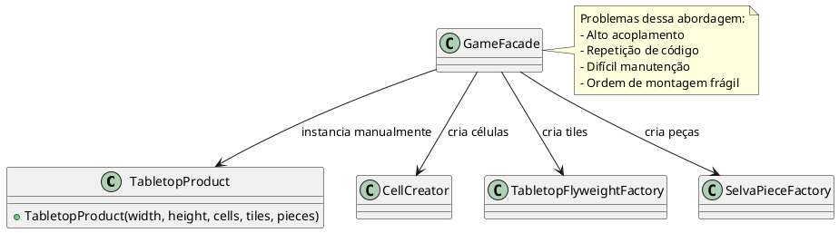

Nesse cenário, construir o TabletopProduct manualmente exige que o código cliente conheça e controle cada detalhe do processo: criação das células com CellCreator, montagem visual com TabletopFlyweightFactory, e posicionamento de peças com SelvaPieceFactory. Se o tabuleiro se tornar mais complexo — com novos componentes, peças adicionais ou uma ordem específica de configuração — esse código se torna difícil de manter, altamente repetitivo e fortemente acoplado à lógica interna do produto. Qualquer alteração na estrutura do TabletopProduct obrigaria mudanças em todos os pontos onde ele é instanciado manualmente.

Para resolver esses problemas, aplicamos o padrão Builder. Esse padrão separa a construção do objeto (TabletopProduct) de sua representação final, permitindo que ele seja montado passo a passo. Em vez de o cliente lidar diretamente com a complexidade da montagem, ele utiliza um TabletopBuilder que expõe métodos encadeáveis para configurar dimensões, células, tiles e peças. Por fim, o TabletopDirector coordena a ordem de construção, garantindo que o produto final seja sempre consistente e completo.

No nosso exemplo, o uso do Builder tornou a criação do tabuleiro modular, reutilizável e muito mais legível. O cliente não precisa mais se preocupar com a ordem correta de inicialização ou com os detalhes de cada componente, promovendo uma separação clara entre construção e uso.

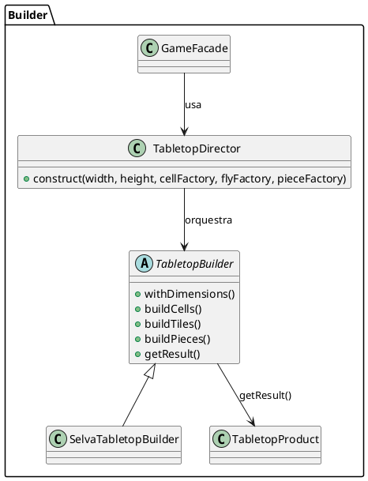

## Estrutura do padrão (GOF - papeis)
  


## Padrão aplicado no cenário

A montagem de um TabletopProduct, que representa o tabuleiro com suas peças e células, exige diversas etapas interdependentes: criação das tiles, posicionamento das peças e configuração da estrutura geral. Sem um padrão de construção, o código cliente teria que orquestrar diretamente todas essas etapas, utilizando várias classes como CellCreator, TabletopFlyweightFactory e SelvaPieceFactoryImpl em ordem manual, o que resultaria em código repetitivo, frágil e difícil de manter.

Com o uso do padrão Builder, essas etapas foram encapsuladas em implementações como SelvaTabletopBuilder, que se responsabiliza por construir os elementos do tabuleiro. O TabletopDirector coordena a ordem correta da montagem, chamando métodos como buildTiles() e buildPieces() de forma centralizada. Isso permite que o cliente apenas chame director.construct() para obter um tabuleiro montado corretamente, sem precisar conhecer os detalhes da composição interna.


  
## Participantes 

| Papel                   | Classe                    | Descrição                                                                                                                                          |
|-------------------------|---------------------------|----------------------------------------------------------------------------------------------------------------------------------------------------|
| **Builder**             | `TabletopBuilder`         | Define a interface para construir as partes do objeto complexo. Declara métodos para configurar a área do tabuleiro e os componentes (tiles), retornando o próprio builder para encadeamento. E expõe `getResult()` que retorna o produto final. |
| **ConcreteBuilder**     | `SelvaTabletopBuilder`    | Implementa `TabletopBuilder`. Armazena os valores configurados (área, matriz de células, tiles e peças) e, ao final, constrói e retorna uma instância de `TabletopProduct`.                              |
| **Director**            | `TabletopDirector`        | Controla o processo de construção, definindo a ordem e os passos necessários para montar o objeto. Utiliza o builder para criar de forma consistente o `TabletopProduct`.                             |
| **Product**             | `TabletopProduct`         | É o objeto complexo resultante (o tabuleiro de jogo). Contém atributos como dimensões, matriz de células, coleção de componentes (tiles) e peças, e oferece métodos para acessá-los.               |


## Código 

### **TabletopBuilder (Builder)**

@import "framework-tabuleiro/src/builder/TabletopBuilder.java"

### **TabletopConcreteBuilder**

@import "framework-tabuleiro/src/builder/SelvaTabletopBuilder.java"

### **TabletopDirector**

@import "framework-tabuleiro/src/builder/TabletopDirector.java"


### **TabletopProduct**

@import "framework-tabuleiro/src/builder/TabletopDirector.java"

# 2. Factory Method

##  Intenção

Definir uma interface para criar um objeto, mas deixar as subclasses decidirem que classe instanciar. O Factory Method permite adiar a instanciação para subclasses.

## Motivação

Em um framework de jogo de tabuleiro como o Selva, as células do tabuleiro possuem diferentes tipos (grama, água, armadilhas, tocas), e a criação de cada tipo deve seguir regras específicas de posicionamento. Sem um padrão adequado, o código cliente precisaria instanciar manualmente as classes concretas (LandCell, TrapCell, DenCell, etc.), o que tornaria o sistema rígido, com alto acoplamento e difícil de manter.

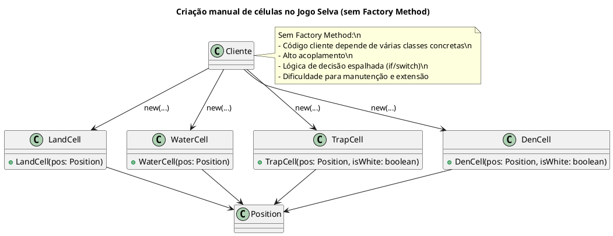

Com o Factory Method, o processo de criação é encapsulado em um criador abstrato, permitindo a flexibilidade e a reutilização do código ao instanciar os produtos corretos conforme a necessidade.

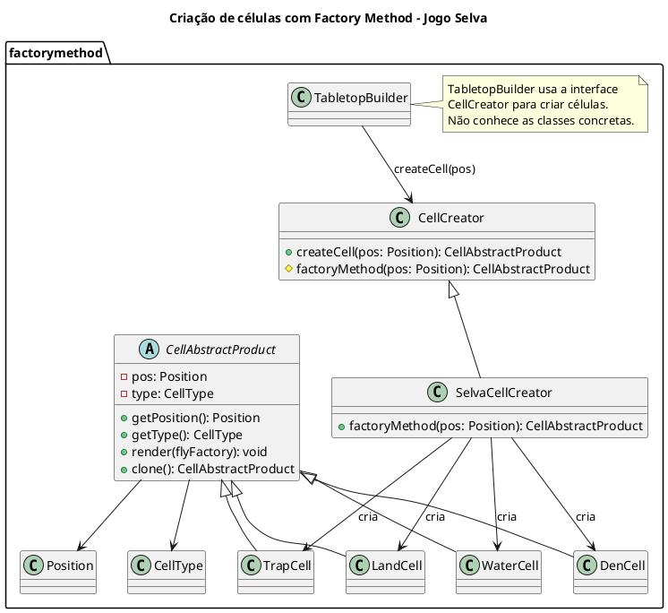

## Estrutura do Padrão (GOF - Papéis)


## Padrão aplicado no cenário

Durante a construção do tabuleiro, diferentes tipos de células precisam ser criadas no jogo Selva (como LandCell, TrapCell, WaterCell, etc.). Com o padrão Factory Method, cada tipo de célula possui seu próprio CellCreator concreto, como WaterCellCreator, que encapsula a lógica de criação. O cliente trabalha com a interface CellCreator e não precisa conhecer a implementação real. Isso facilita a extensão do sistema com novos tipos de célula, respeitando o princípio do aberto-fechado.

## Participantes

| Papel                   | Classe                     | Descrição                                                                                                                                       |
|-------------------------|----------------------------|-------------------------------------------------------------------------------------------------------------------------------------------------|
| **Creator**             | `CellCreator`              | Classe abstrata que declara o método `createCell(pos)` e delega a criação ao `factoryMethod(pos)`. Fornece uma interface comum para criadores de células. |
| **ConcreteCreator**     | `SelvaCellCreator`         | Implementa `factoryMethod(pos)` com lógica de decisão baseada na posição, criando diferentes tipos de células (`LandCell`, `WaterCell`, etc.). |
| **ConcreteCreator**     | `LandCellCreator`, `TrapCellCreator`, etc. | Fornecem implementação direta e fixa de um tipo específico de célula do jogo (`LAND`, `TRAP`, etc.).                                           |
| **Product**             | `CellAbstractProduct`      | Classe abstrata que define a interface comum para todas as células do jogo. Define métodos como `render()` e `clone()`.                        |
| **ConcreteProduct**     | `LandCell`, `WaterCell`, `TrapCell`, `DenCell` | Implementam `CellAbstractProduct` com comportamentos específicos de cada tipo de célula.                                                        |
| **Cliente**             | `TabletopBuilder`          | Usa o Factory Method indiretamente ao chamar `createCell()` no processo de construção do tabuleiro, desacoplando o cliente das classes concretas. |


---

## Código

### **TabletopAbstractProduct (CellAbstractProduct)**

@import "framework-tabuleiro/src/factorymethod/CellAbstractProduct.java"

@import "framework-tabuleiro/src/factorymethod/TabletopAbstractProduct.java"


### **TabletpoConcreteCreator (DenBlackCellCreator, DenWhiteCellCreator,WaterCellCreator,LandCellCreator, TrapWhiteCellCreator, TrapBlackCellCreator, SelvaCellCreator)**

@import "framework-tabuleiro/src/factorymethod/DenBlackCellCreator.java"

@import "framework-tabuleiro/src/factorymethod/DenWhiteCellCreator.java"

@import "framework-tabuleiro/src/factorymethod/WaterCellCreator.java"

@import "framework-tabuleiro/src/factorymethod/LandCellCreator.java"

@import "framework-tabuleiro/src/factorymethod/TrapWhiteCellCreator.java"

@import "framework-tabuleiro/src/factorymethod/TrapBlackCellCreator.java"

@import "framework-tabuleiro/src/factorymethod/TabletopConcreteCreator.java"

@import "framework-tabuleiro/src/factorymethod/SelvaCellCreator.java"

### **TabletopConcreteProduct (LandCell,DenCell,WaterCell,TrapCell)**

@import "framework-tabuleiro/src/factorymethod/DenCell.java"

@import "framework-tabuleiro/src/factorymethod/WaterCell.java"

@import "framework-tabuleiro/src/factorymethod/TrapCell.java"

@import "framework-tabuleiro/src/factorymethod/TabletopConcreteProduct.java"


### **TabletopCreator, CellCreator**


@import "framework-tabuleiro/src/factorymethod/TabletopCreator.java"

@import "framework-tabuleiro/src/factorymethod/CellCreator.java"


# 3. Abstract Factory

## Intenção 

Fornecer uma interface para criação de famílias de objetos relacionados ou dependentes sem especificar suas classes concretas.

## Motivação

Em um jogo como Selva, cada jogador possui várias peças diferentes (Leão, Elefante, Rato, etc.), e cada uma dessas peças precisa ser criada com:

Um nome específico

Uma estratégia de movimentação diferente

Um lado (branco ou preto)

E uma posição inicial no tabuleiro

Sem um padrão adequado, o código de inicialização do jogo precisaria conter múltiplas linhas como:

```java
Peca leaoBranco = new Peca("Leão", PlayerSide.WHITE, new LeaoMovimentoStrategy(), new Position(0, 3));
Peca elefantePreto = new Peca("Elefante", PlayerSide.BLACK, new ElefanteMovimentoStrategy(), new Position(6, 2));
// e assim por diante...
```

**UML - Sem Padrão** 

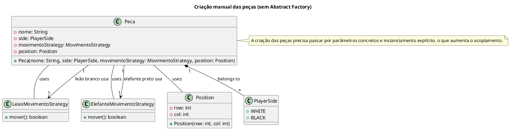

Com o uso do padrão Abstract Factory, definimos uma interface para criação de famílias de peças relacionadas, e implementamos essa fábrica conforme as regras do jogo Selva. Isso permite:

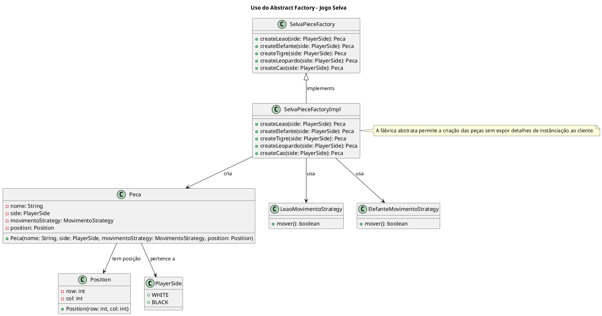

- Encapsular a lógica de criação de peças em um único lugar

- Desacoplar o código cliente (como o TabletopBuilder) dos detalhes de instanciamento

- Facilitar a criação de variações do jogo, com outras regras ou conjuntos de peças, apenas trocando a implementação da fábrica

### Estrutura do padrão (GOF - Papeis)

## Padrão aplicado no cenário

Durante a construção do jogo  Selva, é necessário posicionar diversas peças com comportamentos e nomes específicos. Sem a aplicação de Abstract Factory, o código de montagem teria que conhecer diretamente todas as classes concretas de peças, como `Peca`, `NullPiece`, ou qualquer outra personalizada. Isso criaria um forte acoplamento entre o construtor do tabuleiro (como `SelvaTabletopBuilder`) e as peças criadas, dificultando a manutenção e impedindo a variação temática do jogo.

Com Abstract Factory, extraímos a lógica de criação das peças para uma interface `SelvaPieceFactory`. O builder então solicita uma peça sem saber qual classe concreta será retornada — ele apenas chama `factory.createLion()` ou `factory.createDefault()`. Isso permite trocar toda a família de peças (por exemplo, peças de xadrez ou de outro tema) apenas injetando uma nova implementação da fábrica, sem alterar o código de montagem ou o restante do framework.

## Participantes
| Participante       | Classe no Projeto        | Função                                                                 |
|--------------------|--------------------------|------------------------------------------------------------------------|
| **AbstractFactory** | `SelvaPieceFactory`      | Declara a interface para operações que criam objetos de peças abstratas (`Peca`). |
| **ConcreteFactory** | `SelvaPieceFactoryImpl`  | Implementa as operações de criação de objetos concretos. Cria peças concretas (como `Leão`, `Elefante`, etc.). |
| **AbstractProduct** | `Peca`                   | Declara a interface para os objetos produto, neste caso, as peças do jogo. Define métodos como `mover()`, `getNome()`, `getPosition()`, entre outros. |
| **ConcreteProduct** | `Leao`, `Elefante`, `Tigre`, `Rato`, etc. | Define os objetos concretos que são instanciados pelas fábricas concretas (peças específicas com suas respectivas estratégias de movimento). |
| **Client**          | `TabletopBuilder`        | O Builder age como o "cliente" que utiliza a `SelvaPieceFactory` para criar as peças, configurar o tabuleiro e delegar o processo de criação sem se preocupar com a implementação concreta. |

## Código

### **AbstractFactory (SelvaPieceFactory)**
@import "framework-tabuleiro/src/abstractfactory/SelvaPieceFactory.java"

### **ConcreteFactory(SelvaPieceFactoryImpl)**
@import "framework-tabuleiro/src/abstractfactory/SelvaPieceFactoryImpl.java"

### **AbstractProduct(Peca)**
@import "framework-tabuleiro/src/context/Peca.java"

### **ConcreteProduct(Leao,Tigre etc..)**
@import "framework-tabuleiro/src/abstractfactory/SelvaPieceFactory.java"

### **Client (TabletopBuilder)**

@import "framework-tabuleiro/src/builder/TabletopBuilder.java"

# 4. Strategy Pattern

## Intenção
Definir uma família de algoritmos, encapsular cada uma delas e torná-las intercambiáveis. Strategy permite que o algoritmo varie independentemente dos clientes que o utilizam.

## Motivação
Em um framework de jogo de tabuleiro, diferentes peças podem ter regras de movimentação distintas. Sem o padrão Strategy, teríamos que ter uma lógica condicional pesada dentro de cada peça para tratar variações no movimento (como movimentos básicos, saltos, ou movimentos especiais). Isso acarreta:

- Toda a lógica de movimentação ficaria acoplada à classe da peça, dificultando a manutenção e a extensão.

- Alterar uma regra de movimentação implicaria alterar a classe da peça diretamente, afetando possivelmente várias áreas do sistema.

- Permite utilizar o mesmo algoritmo de movimentação para diferentes tipos de peças, promovendo a reutilização e a consistência.

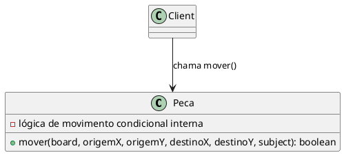

Com o Strategy, encapsulamos as diferentes regras de movimentação em classes separadas. Assim, a peça se torna um contexto que delega a sua operação de movimento à estratégia vigente, permitindo a mudança dinâmica do comportamento sem alterar o código da peça.

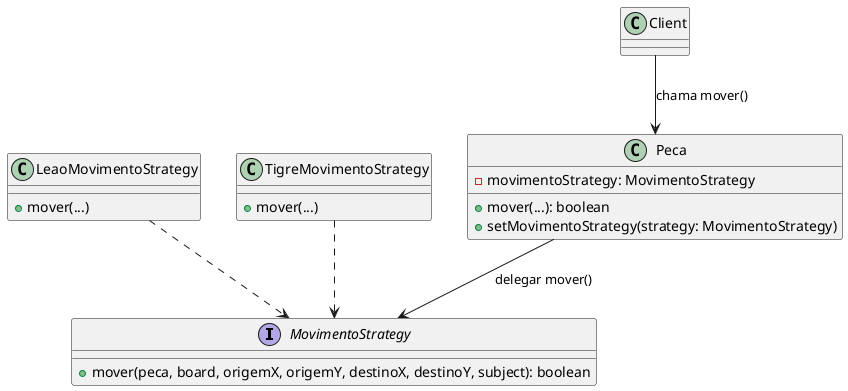

## Estrutura do Padrão (GOF - Papéis)

## Padrão aplicado no cénario

Cada tipo de peça no jogo possui regras de movimentação específicas. Sem o uso do padrão Strategy, a lógica de movimento de todas as peças estaria centralizada em uma única classe ou método, cheia de condicionais para verificar o tipo da peça, o que tornaria o código rígido, difícil de manter e não extensível. Com o padrão Strategy, cada peça recebe uma instância de MovimentoStrategy correspondente, como LeaoMovimentoStrategy, TigreMovimentoStrategy, MovimentoBasicoStrategy, etc. A lógica de movimento fica encapsulada em classes especializadas, e o cliente pode trocar ou configurar comportamentos dinamicamente, sem modificar o código das peças.

### Participantes

| Participante       | Classe no Projeto        | Função                                                                 |
|--------------------|--------------------------|------------------------------------------------------------------------|
| **Strategy**        | `MovimentoStrategy`      | Declara a interface para a estratégia de movimento das peças. Define o método `mover()`. |
| **ConcreteStrategy** | `LeaoMovimentoStrategy`, `ElefanteMovimentoStrategy`, `TigreMovimentoStrategy`, etc. | Implementam o comportamento de movimento específico para cada tipo de peça (Leão, Elefante, Tigre, etc.). |
| **Context**         | `Peca`                   | A peça que utiliza a estratégia de movimento. Define o método `setMovimentoStrategy()` para alterar a estratégia de movimento em tempo de execução. |
| **Client**          | `TabletopBuilder`        | O Builder que configura as peças do jogo e as associa com suas respectivas estratégias de movimento através da fábrica (`SelvaPieceFactory`). |


## Exemplo de Código

#### Strategy - (MovimentoStrategy)
@import "framework-tabuleiro/src/strategy/MovimentoStrategy.java"


#### ConcreteStrategy (LeaoMovimentoStrategy,ElefanteMovimentoStrategy,GatoMovimentoStrategy, LeopardoMovimentoStrategy,LoboMovimentoStrategy,CaoMovimentoStrategy,RatoMovimentoStrategy MovimentoBasicoStrategy, TigreMovimentoStrategy) 
@import "framework-tabuleiro/src/strategy/LeaoMovimentoStrategy.java"
@import "framework-tabuleiro/src/strategy/ElefanteMovimentoStrategy.java"
@import "framework-tabuleiro/src/strategy/GatoMovimentoStrategy.java"
@import "framework-tabuleiro/src/strategy/LeopardoMovimentoStrategy.java"
@import "framework-tabuleiro/src/strategy/LoboMovimentoStrategy.java"
@import "framework-tabuleiro/src/strategy/CaoMovimentoStrategy.java"
@import "framework-tabuleiro/src/strategy/RatoMovimentoStrategy.java"
@import "framework-tabuleiro/src/strategy/TigreMovimentoStrategy.java"

@import "framework-tabuleiro/src/strategy/MovimentoBasicoStrategy.java"


#### Context (Peca)
@import "framework-tabuleiro/src/context/Peca.java"

#### Client (TabletopBuilder)
@import "framework-tabuleiro/src/builder/TabletopBuilder.java"


## 2. Composite

## Intenção

Compor objetos em estruturas de árvore para representarem hierarquias partes-todo. Composite permite aos clientes tratarem de maneira uniforme objetos individuais e composições de objetos.

## Motivação

Ao desenvolver jogos de tabuleiro como o Selva, rapidamente percebemos que o tabuleiro é formado por diversos componentes — células, peças isoladas e grupos de células ou peças que devem ser tratados de forma hierárquica. Sem o Composite, o código cliente acaba precisando:


- Distinguir manualmente entre objetos simples e compostos;
- Iterar por listas heterogêneas de tiles, chamando métodos diferentes para cada tipo;
- Gerir detalhes de montagem e atualização de modo espalhado pelo código, aumentando o acoplamento e a duplicação.
- Isso torna o código verbose e difícil de estender ou manter.

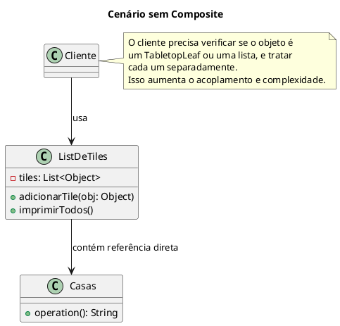

Com o padrão Composite, folhas (tiles individuais) e composições (grupos de tiles) implementam a mesma interface, permitindo que o cliente trate ambos de forma uniforme — basta invocar operation() sem se preocupar com a estrutura interna.


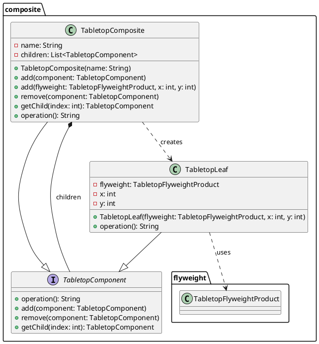

## Estrutura do padrão (GOF - papeis)


## Padrão aplicado no cenário

O TabletopProduct precisa representar uma estrutura hierárquica contendo múltiplos elementos: tiles, células ou até grupos de células. Sem o uso do padrão Composite, seria necessário tratar cada componente individualmente, exigindo verificações manuais e lógicas duplicadas para iterar, renderizar ou interagir com os elementos do tabuleiro.

Com o padrão Composite, criamos a interface TabletopComponent, implementada por TabletopLeaf e TabletopComposite. O tabuleiro pode ser modelado como uma árvore de componentes, em que cada Composite pode conter outros Component. Isso permite que o cliente trate estruturas compostas e elementos individuais de forma uniforme, facilitando operações recursivas como render() e tornando a estrutura extensível.

## Participantes 

### Padrão Composite

| Participante       | Classe no Projeto        | Função                                                                 |
|--------------------|--------------------------|------------------------------------------------------------------------|
| **Component**      | `TabletopComponent`      | Interface comum para objetos folha e compostos. Define o método `operation()`. |
| **Leaf**           | `TabletopLeaf`           | Representa objetos individuais (tiles simples) que não possuem filhos. |
| **Composite**      | `TabletopComposite`      | Representa agrupamentos de componentes. Permite adicionar/remover/acessar filhos e delega operações para eles. |


## Código 


### **TabletopComponent**

@import "framework-tabuleiro/src/composite/composite/TabletopComponent.java"


### **TabletopComposite**

@import "framework-tabuleiro/src/composite/composite/TabletopComposite.java"


### **TabletopLeaf**

@import "framework-tabuleiro/src/composite/composite/TabletopLeaf.java"


# Flyweight

## Intenção

Usar compartilhamento para suportar eficientemente grandes quantidades de objetos de granularidade fina.
(GOF)

## Motivação
No desenvolvimento de jogos de tabuleiro, como o jogo Selva, o tabuleiro é composto por inúmeros tiles que podem apresentar características idênticas. Por exemplo, várias casas do tabuleiro podem ter o mesmo tipo (água, armadilha, toca, etc.).

Sem o Flyweight, cada tile seria instanciado individualmente, consumindo mais memória e tornando o gerenciamento desses objetos mais complexo.


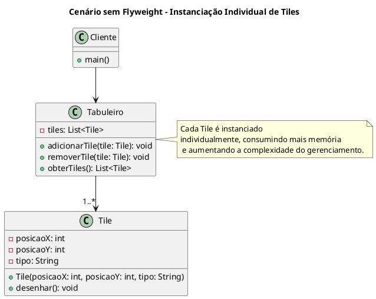

Com o Flyweight, podemos compartilhar instâncias de tiles com estados idênticos, fazendo com que o código cliente não precise criar novas instâncias para cada tile repetido. Assim, o sistema se torna mais leve e eficiente.


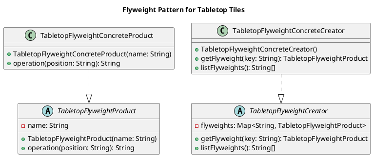

## Estrutura do padrão (GOF - papeis)


## Padrão aplicado no cenário

No cenário do jogo Selva, o tabuleiro possui muitas casas (tiles) que podem ter características repetidas, como a cor ou a função (água, armadilha, toca, etc.).
Utilizando o Flyweight, o sistema cria apenas uma instância para cada tipo de tile e compartilha essa instância entre todas as casas que apresentem o mesmo tipo.
Dessa forma, o cliente não precisa instanciar repetidamente objetos iguais, reduzindo o consumo de memória e simplificando o gerenciamento dos tiles.


  
## Participantes 

- **Flyweight (TabletopFlyweightProduct):**
  - Define a interface para os objetos compartilhados, encapsulando o estado intrínseco (por exemplo, o nome ou tipo do tile).
  - Contém o método operation() que realiza uma operação usando o estado intrínseco, junto com o estado extrínseco (passado como parâmetro, por exemplo, a posição do tile).

- **Concrete Flyweight (TabletopFlyweightConcreteProduct)**
  - Implementa a interface do Flyweight e define o comportamento concreto do tile compartilhado.
  
- **FlyweightFactory (TabletopFlyweightCreator):**
  - Representa objetos que possuem filhos (outros componentes).
  - Implementa métodos para adicionar, remover e acessar os filhos.
  - Implementa a interface TabletopComponent de maneira a delegar operações para os filhos.


## Código 

### **TabletopFlyweightConcreteCreator**

```java
package flyweight;
// Fábrica concreta que reutiliza instâncias de tiles
import java.util.HashMap;

public class TabletopFlyweightConcreteCreator extends TabletopFlyweightFactory {

    public TabletopFlyweightConcreteCreator() {
        flyweights = new HashMap<>();
    }

    @Override
    public TabletopFlyweightProduct getFlyweight(String key) {
        if (!flyweights.containsKey(key)) {
            flyweights.put(key, new TabletopFlyweightConcreteProduct(key));
        }
        return flyweights.get(key);
    }

    @Override
    public String[] listFlyweights() {
        return flyweights.keySet().toArray(new String[0]);
    }
}
```
### **TabletopFlyweightConcreteProduct**
```java
package flyweight;
// Implementação concreta do objeto compartilhado
public class TabletopFlyweightConcreteProduct extends TabletopFlyweightProduct {

    public TabletopFlyweightConcreteProduct(String name) {
        super(name);
    }

    @Override
    public String operation(String position) {
        return "Tile: " + name + " em " + position;
    }
}

```

## **TabletopFlyweightFactory**
```java
package flyweight;
// Interface da fábrica de flyweights
import java.util.Map;

public abstract class TabletopFlyweightFactory {
    protected Map<String, TabletopFlyweightProduct> flyweights;

    public abstract TabletopFlyweightProduct getFlyweight(String key);
    public abstract String[] listFlyweights();
}

```

## **TabletopFlyweightProduct**

```java
package flyweight;
// Compartilha objetos similares para economizar memória
public abstract class TabletopFlyweightProduct {
    protected String name;

    public TabletopFlyweightProduct(String name) {
        this.name = name;
    }

    public abstract String operation(String position);
}
```

# Prototype 

## Intenção

Especificar os tipos de objetos a serem criados usando uma instância-protótipo e criar novos objetos pela cópia desse protótipo.

## Motivação

Em cenários onde os objetos a serem criados são complexos – como um tabuleiro de jogo com uma série de componentes e configurações – a criação direta por meio de um construtor pode ser ineficiente e resultar em código redundante. 

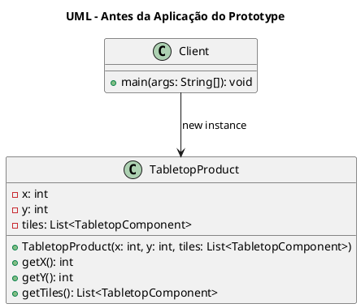
Sem o uso do Prototype, cada vez que um objeto complexo precisasse ser replicado, seria necessário chamar o construtor com todos os seus parâmetros, o que poderia levar a erros e dificultar a manutenção.

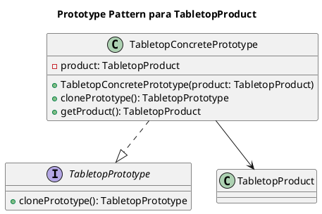

Utilizando o Prototype, o framework pode gerar novas instâncias de um objeto complexo por meio da clonagem de um protótipo previamente configurado. Essa abordagem simplifica a criação de cópias, diminui o acoplamento com classes concretas e torna o sistema mais flexível para alterações futuras, além de melhorar a performance em operações onde a criação completa do objeto seria muito custosa.

## Padrão aplicado no cenário
No nosso cenário, estamos construindo um tabuleiro que pode ser composto por peças individuais ou agrupamentos de peças. Ao aplicar o padrão Composite, conseguimos manipular esses elementos de forma hierárquica e uniforme, facilitando operações complexas como movimentação, remoção ou adição de peças no tabuleiro.

## Estrutura do Padrão (GOF - Papéis)


## Participantes:

- **Prototype (TabletopPrototype):**  
  Define a interface para objetos que podem ser clonados, declarando o método `clonePrototype()`. Essa interface é a base para qualquer objeto que deseje suportar clonagem.

- **ConcretePrototype (TabletopConcretePrototype):**  
  Implementa a interface `TabletopPrototype` e armazena internamente um objeto do tipo `TabletopProduct`. Ao invocar o método `clonePrototype()`, é retornada uma nova instância do protótipo (no caso, utilizando uma cópia superficial do produto).

- **Product (TabletopProduct):**  
  Embora não faça parte direta do padrão Prototype, este objeto complexo é o que está sendo clonado. Ele representa o tabuleiro de jogo com sua configuração e componentes.

## Código

### **TabletopPrototype**

```java
package prototype;
// Interface para objetos que podem ser clonados
public interface TabletopPrototype {
    TabletopPrototype clonePrototype();
}
```

### **TabletopConcretePrototype**

```java
package prototype;
// Implementação concreta do protótipo

import builder.TabletopProduct;

public class TabletopConcretePrototype implements TabletopPrototype {
    private TabletopProduct product;

    public TabletopConcretePrototype(TabletopProduct product) {
        this.product = product;
    }

    @Override
    public TabletopPrototype clonePrototype() {
        return new TabletopConcretePrototype(product); // shallow copy
    }

    public TabletopProduct getProduct() {
        return product;
    }
}
```

# Observer

## Intenção

Definir uma dependência um-para-muitos entre objetos, de maneira que quando um
objeto muda de estado todos os seus dependentes são notificados e atualizados
automaticamente

## Motivação

Em um framework de jogo de tabuleiro, diversas partes do sistema podem precisar reagir a alterações no estado do jogo, como atualizações na pontuação, mudança de turno ou alterações no estado do tabuleiro. Sem o Observer Pattern, cada componente precisaria interrogar constantemente o estado do jogo ou ser explicitamente atualizado por métodos diretos, aumentando o acoplamento e a complexidade do código.
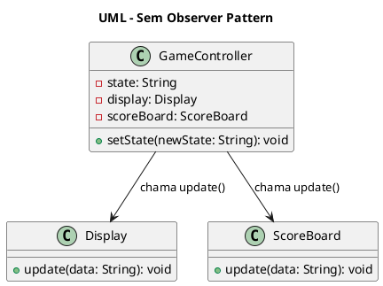

Com o Observer Pattern, o sujeito central (por exemplo, um controlador de estado do jogo) notifica automaticamente todos os observadores registrados assim que seu estado muda, garantindo que a interface do usuário, o sistema de pontuação e outros módulos recebam as atualizações em tempo real e de forma desacoplada.

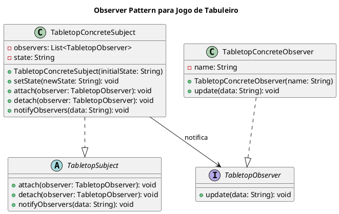

## Estrutura do Padrão (GOF - Papéis)


## Participantes

- **Observer (TabletopObserver):**
  - Define a interface para os observadores que desejam receber atualizações.
  - Declara o método `update(String data)`, que será chamado pelo sujeito quando ocorrer uma mudança de estado.

- **Subject (TabletopSubject):**
  - Define a interface ou classe abstrata para o sujeito observado.
  - Declara os métodos `attach(TabletopObserver observer)`, `detach(TabletopObserver observer)` e `notifyObservers(String data)`, responsáveis por gerenciar os observadores e disseminar atualizações.

- **ConcreteSubject (TabletopConcreteSubject):**
  - Implementa a classe abstrata `TabletopSubject` e mantém o estado interno do objeto.
  - Quando seu estado é alterado (por meio do método `setState(String newState)`), ele notifica todos os observadores registrados.

- **ConcreteObserver (TabletopConcreteObserver):**
  - Implementa a interface `TabletopObserver`.
  - Define o comportamento do observador quando uma atualização é recebida, por exemplo, exibindo a mensagem de atualização no console.
  
## Código

### **TabletopConcreteObserver**

```java
package observer;
// Observador concreto
public class TabletopConcreteObserver implements TabletopObserver {
    private String name;

    public TabletopConcreteObserver(String name) {
        this.name = name;
    }

    @Override
    public void update(String data) {
        System.out.println(name + " recebeu atualização: " + data);
    }
}
```

### **TabletopConcreteSubject**
```java
package observer;
// Sujeito concreto que mantém estado
import java.util.ArrayList;
import java.util.List;

public class TabletopConcreteSubject extends TabletopSubject {
    private List<TabletopObserver> observers = new ArrayList<>();
    private String state;

    public TabletopConcreteSubject(String initialState) {
        this.state = initialState;
    }

    public void setState(String newState) {
        this.state = newState;
        notifyObservers(this.state);
    }

    @Override
    public void attach(TabletopObserver observer) {
        observers.add(observer);
    }

    @Override
    public void detach(TabletopObserver observer) {
        observers.remove(observer);
    }

    @Override
    public void notifyObservers(String data) {
        for (TabletopObserver observer : observers) {
            observer.update(data);
        }
    }
}

```

### **TabletopObserver**
```java
package observer;
// Interface para observadores
public interface TabletopObserver {
    void update(String data);
}
```

### **TabletopSubject**
```java
package observer;
// Interface do sujeito observado
public abstract class TabletopSubject {
    public abstract void attach(TabletopObserver observer);
    public abstract void detach(TabletopObserver observer);
    public abstract void notifyObservers(String data);
}
```


# Command Pattern

## Intenção

Encapsular uma solicitação como um objeto, desta forma permitindo parametrizar clientes com diferentes solicitações, enfileirar ou fazer o registro (log) de solicitações e suportar operações que podem ser desfeitas

## Motivação

Em um framework de jogo de tabuleiro, sem o padrão Command o cliente (por exemplo, a interface de usuário) teria que chamar diretamente métodos das peças (ex.: `mover()`). Isso leva a algumas dificuldades:

- **Acoplamento Elevado:** O cliente precisaria conhecer os detalhes da implementação e do receptor, tornando difícil modificar a lógica ou substituir funcionalidades.
- **Dificuldade para Log e Replay:** Sem o encapsulamento, registrar as jogadas e reproduzi-las (replay) exigiria lógica repetitiva e espalhada.
- **Complexidade no Suporte a Undo/Redo:** Sem Command, implementar desfazer e refazer operações demandaria que a lógica de reversão estivesse presente em vários pontos da aplicação.

Com o Command, cada ação do jogo (como mover uma peça) é encapsulada em um objeto comando. Isso possibilita registrar, enfileirar, reexecutar e, futuramente, desfazer ações sem que o cliente precise entender os detalhes da implementação.

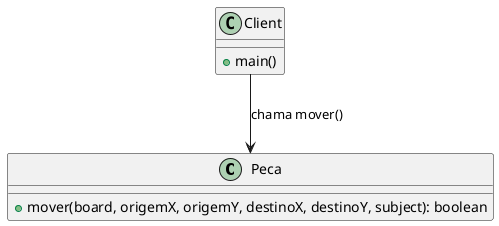

Com o padrão Command, o processo de execução torna-se independente do receptor. O cliente simplesmente invoca o comando, que registra e executa a ação, possibilitando o registro para replay e suporte a undo/redo (se implementado).

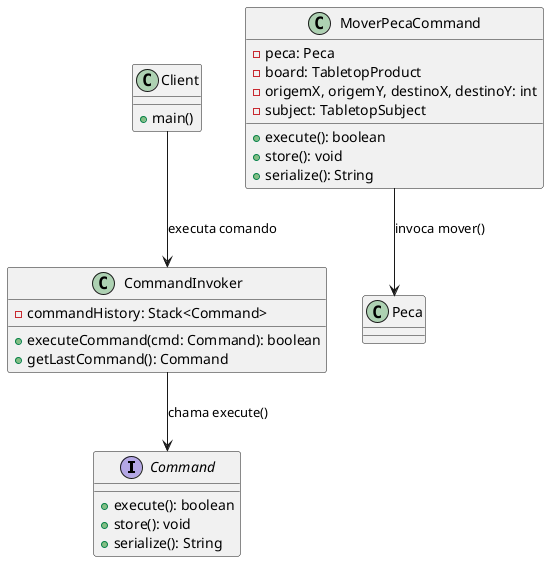
## Estrutura do Padrão (GOF - Papéis)

### Participantes
- **Command (Interface Command):**
  - Declara uma interface para a execução da operação (execute()), armazenamento (store()) e serialização (serialize()).

- **ConcreteCommand (MoverPecaCommand):**
  - Encapsula a ação de mover uma peça, armazenando o receptor (a peça) e os detalhes da operação (coordenadas de origem e destino, tabuleiro e sujeito para notificação).
  - Implementa execute(), que chama o método mover() da peça, e armazena o comando em log, possibilitando seu registro.

- **Invoker (CommandInvoker):**
  - Solicita a execução do comando.
  - Armazena os comandos executados em um histórico, possibilitando ações futuras como "undo" ou "redo".

- **Client (CommandLogManager / Interface de Usuário):**
  - Cria instâncias de comandos com os dados necessários.
  - Pode carregar comandos previamente armazenados para reexecução (replay) através do log.

- **Receiver (Peca):**
  - Contém o conhecimento para executar a solicitação (por exemplo, mover-se no tabuleiro).
  - Interage com outros padrões (Strategy, State, Observer) para validar e executar a ação.
  
## Exemplo de Código: 

### Command
```java
package command;

public interface Command {
    boolean execute();
    void store();
    String serialize();
}
```
### MoverPecaCommand - ConcreteCommand

```java
package command;

import context.Peca;
import builder.TabletopProduct;
import observer.TabletopSubject;
import java.io.FileWriter;
import java.io.IOException;
import java.io.PrintWriter;

public class MoverPecaCommand implements Command {

    private Peca peca;
    private TabletopProduct board;
    private int origemX, origemY, destinoX, destinoY;
    private TabletopSubject subject;
    
    public MoverPecaCommand(Peca peca, TabletopProduct board,
                            int origemX, int origemY,
                            int destinoX, int destinoY,
                            TabletopSubject subject) {
        this.peca = peca;
        this.board = board;
        this.origemX = origemX;
        this.origemY = origemY;
        this.destinoX = destinoX;
        this.destinoY = destinoY;
        this.subject = subject;
    }
    
    @Override
    public boolean execute() {
        System.out.println("Executando comando para mover a peça " + peca.getNome());
        boolean resultado = peca.mover(board, origemX, origemY, destinoX, destinoY, subject);
        if(resultado) {
            store();
        }
        return resultado;
    }
    
    @Override
    public String serialize() {
        return "MoverPecaCommand;" + peca.getNome() + ";" + origemX + ";" + origemY + ";" + destinoX + ";" + destinoY;
    }
    
    @Override
    public void store() {
        try (PrintWriter out = new PrintWriter(new FileWriter("command.log", true))) {
            out.println(serialize());
            System.out.println("Comando armazenado: " + serialize());
        } catch(IOException e) {
            System.err.println("Erro ao armazenar comando: " + e.getMessage());
        }
    }
}
```
###  CommandInvoker - Invoker
```java

package command;

import java.util.Stack;

public class CommandInvoker {
    private Stack<Command> commandHistory = new Stack<>();
    
    public boolean executeCommand(Command command) {
        boolean result = command.execute();
        if(result) {
            commandHistory.push(command);
        }
        return result;
    }
    
    public Command getLastCommand() {
        if (!commandHistory.isEmpty()) {
            return commandHistory.peek();
        }
        return null;
    }
}

```

### CommandLogManager - Client Help
```java
package command;

import java.io.BufferedReader;
import java.io.FileReader;
import java.io.IOException;
import java.util.ArrayList;
import builder.TabletopProduct;
import context.Peca;
import observer.TabletopSubject;
import strategy.LeaoMovimentoStrategy;

public class CommandLogManager {

   
    public static ArrayList<Command> loadCommands(TabletopProduct board, TabletopSubject subject) {
        ArrayList<Command> comandos = new ArrayList<>();
        try (BufferedReader reader = new BufferedReader(new FileReader("command.log"))) {
            String linha;
            while ((linha = reader.readLine()) != null) {
             
                String[] parts = linha.split(";");
                if (parts.length == 6 && parts[0].equals("MoverPecaCommand")) {
                    String nomePeca = parts[1];
                    int ox = Integer.parseInt(parts[2]);
                    int oy = Integer.parseInt(parts[3]);
                    int dx = Integer.parseInt(parts[4]);
                    int dy = Integer.parseInt(parts[5]);
                    
                    
                    Peca peca = new Peca(nomePeca, new LeaoMovimentoStrategy());
                    Command cmd = new MoverPecaCommand(peca, board, ox, oy, dx, dy, subject);
                    comandos.add(cmd);
                }
            }
        } catch (IOException e) {
            System.err.println("Erro ao carregar comandos do log: " + e.getMessage());
        }
        return comandos;
    }
}
```
## Considerações Finais
- Aplicar o padrão Command ao framework do jogo de tabuleiro oferece os seguintes benefícios:

- Desacoplamento: O cliente (interface ou lógica de controle) invoca comandos sem conhecer os detalhes da execução.

- Histórico de Ações: Cada comando é registrado, permitindo a implementação de replays ou de sistemas de undo/redo.

- Flexibilidade: É simples adicionar novos comandos ou combinar comandos existentes (através de um MacroCommand), facilitando a evolução do sistema.

- Registro e Persistência: Com a serialização e armazenamento no log, o sistema pode restaurar jogadas, facilitando a análise e correção de erros após uma queda de sistema.


## Considerações Finais
- **Desacoplamento do Algoritmo:**
  - A lógica de movimentação é separada da classe Peca, permitindo que estratégias diferentes sejam aplicadas sem modificar o contexto.

- **Flexibilidade e Extensibilidade:**
  - Novos comportamentos de movimento podem ser adicionados como novas implementações de MovimentoStrategy sem a necessidade de alterar a classe Peca ou outras partes do sistema.

- **Reutilização:**
O mesmo algoritmo de movimentação pode ser utilizado por diversas peças, promovendo a reutilização e facilitando a manutenção.